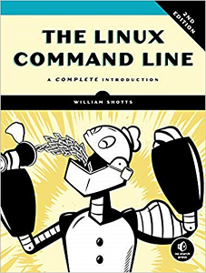
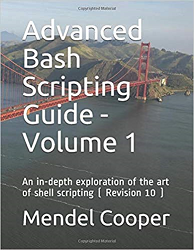
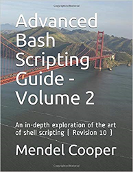
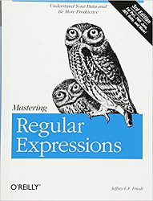

```{r include = FALSE}
knitr::opts_chunk$set(echo = TRUE, eval=TRUE, fig.width = 4, 
                      fig.height = 5, warning = FALSE, 
                      message = FALSE, encoding = "UTF-16")
```

Here are a list of books for learning Unix/Linux.  

* The Linux Command Line: A Complete Introduction by William Shotts.  



* Advanced Bash Scripting Guide - Volume 1 and 2: An in-depth exploration of the art of shell scripting ( Revision 10 )  by Mendel Cooper.  



* Mastering Regular Expression by Jeffrey EF. Friedl  
  

