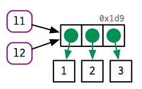

```{r include = FALSE}
knitr::opts_chunk$set(echo = TRUE, eval=TRUE, fig.width = 4, 
                      fig.height = 5, warning = FALSE, 
                      message = FALSE, encoding = "UTF-8")
Sys.setlocale("LC_ALL", "en_US.UTF-8")
```

  


## About R  
* R is a high-level programming language and free software environment for statistical computing and graphics, used for statistical inference, data analysis and machine learning.
* Derived from the [S programming language](https://en.wikipedia.org/wiki/S_(programming_language)) and created by Ross Ihaka and Robert Gentleman in 1995.
* The main R implementation is written primarily in C, FORTRAN, and R itself, and maintained by by the R Development Core Team.
* Open source, freely available under the GNU General Public License.
* R packages (15300+ available packages) are contributed and supported by a large community of R developers. Available from its official site [CRAN](https://cran.r-project.org/), [GitHub](https://github.com/) and [Bioconductor](https://www.bioconductor.org/), etc. 
* For more intro to R language, see  [Wikipedia](https://en.wikipedia.org/wiki/R_(programming_language)) and a [Blog](https://www.guru99.com/r-programming-introduction-basics.html).

## [Why Learn R](https://data-flair.training/blogs/why-learn-r/)?


## Install R and Rstudio
  

R is a software that comes with a GUI (Graphical User Interface). But the R GUI looks more similar to the old DOS console than to SPSS or Stata, so it is not very friendly-looking and not very convenient.  
The Rstudio provided a IDE, which is a much great Graphic User Interface for R programming, data analysis and visualization, making your life much easier.

>"You can think of installing R as buying car and of installing R and RStudio as buying a car with all the accessories for a better user experience."  
>-- Mauricio Vargas


Before doing anything related to R programming, please install R and RStudio by following [this great tutorial](https://www.datacamp.com/community/tutorials/installing-R-windows-mac-ubuntu).


## Get started with the Rstudio IDE
Please familiarize yourself with the RStudio Integrated Development Environment by exploring the [Rstudio IDE cheatsheet](https://github.com/rstudio/cheatsheets/raw/master/rstudio-ide.pdf) before you come to the Workshop.  

## Some basic operators
### Assignment operators  

|Operator|Description|
|-------|--------|
|<-|left assignment|
|=|left assignment, but not recommended|
|<<-|left assignment to variables in outer lexical scope|


```{r size="huge"}
x <- 2
x
```

### Subsetting operators  

|Operator|Description|
|-------|--------|
|[ ]|all S3 object subsetting|
|[[ ]]|list/data frame|
|$|list/data frame subseting|
|@|access a S4 object slot|

```{r}
x <- 1:10
x[3]
```

### Arithmetic Operators  

|Operator|Description|
|-------|--------|
|+|addition|
|-|subtraction|
|*|multiplication|
|/|division|
|^ or **|exponentiation|
|x %% y|modulus (x mod y), 5%%2 is 1|
|x %/% y|integer division, 5%/%2 is 2|
|x %*% y|matrix product, crossproduct|
|x %o% y|outer product|

```{r eval = FALSE}
x <- 1:10
y <- 20:29

x + y
x * y

x^2

x %% 2 
```

### Pipe: `%>%`
It was first defined in the **magrittr** package, and widely used by tidyverse packages for data wrangling, a process of transforming and mapping data from one "raw" data form into another format with the intent of making it more appropriate and valuable for a variety of downstream purposes such as analytics. The R pipe operator `%>%` is very similar to the UNIX command line pipe operator `|`. It allows us to build a one liner to  "chain" multiple sequential method calls on a data set. Since each method returns an object, you can actually allow the calls to be chained together in a single statement, without needing variables to store the intermediate results.  

|Operator|Description|
|-------|--------|
|%>%|pipe operator used in the tidyverse package|

```{r}
library("tidyverse")
# You take the Iris data, then you subset the data and then you aggregate the data
iris %>%
  subset(Sepal.Length > 5) %>%
  aggregate(. ~ Species, ., mean)

x <- c(0.109, 0.359, 0.63, 0.996, 0.515, 0.142, 0.017, 0.829, 0.907)
# Compute the logarithm of `x`, return suitably lagged and iterated differences, then compute the exponential function and round the result
round(exp(diff(log(x))), 1)

# Change the above script to a pipe-based expression
library("tidyverse")
x %>% log() %>% diff() %>% exp() %>% round(digits = 1)
```

### Logical Operators  

|Operator|Description|
|--------|-----------|
|<|less than|
|<=|less than or equal to|
|>|greater than|
|>=|greater than or equal to|
|==|exactly equal to|
|!=|not equal to|
|!x|Not x|
|x \| y|x OR y|
|x & y|x AND y|
|x\|\|y|short-circuiting OR|
|x&&y|short-circuiting OR|
|xor(x, y)|elementwise exclusive OR|
|%in%|matching operator, test membership|

**Attention**: difference between | and ||, and & and &&.  

* \| and & are vector boolean operators.  
* || and && are short-circuiting boolean operators.  
* || and && are used in if-else statement, while | and  & are used in subsetting.  

See the truth table below.  

  

```{r}
x <- c(1:10)
x

x > 8
x < 5
x > 8 | x < 5
x[x > 8 | x < 5]

# short circuiting OR (only consider the first pair)
x > 8 | x < 5
x > 8 || x < 5

x > 8 & x < 5
x > 8 && x < 5
```

## R Workspace
R workspace is your current R working environment and includes any user-defined objects (vectors, matrices, data frames, lists, functions).

Best practice: Keep different projects in different physical directories.

### Set and get your current working directory
```{r eval = FALSE}
# print the current working directory - cwd
getwd() 

# change your working directory, which can be absolute or relative directory path
setwd("C:\\Users\\Haibo\\Desktop")  # note / instead of \ in windows
setwd("/usr/haibo/mydir") # on linux
```

### View, check and remove objects existing in your current workspace
```{r eval = FALSE}
# list the objects in the current workspace
ls()

# test if an object exists
exists("a")

# Remove Objects from a Specified Environment
# rm(..., list = character(), pos = -1, envir = as.environment(pos), inherits = FALSE)
a <- 1:10
ls()

rm(a)  # or rm("a")
```

### View and set options (R system setting) for the session
```{r eval = FALSE}
help(options) # learn about available options
options() # view current option settings
options(digits = 3) # number of digits to print on output
```

### Work with your previous commands
Up and down arrow keys scroll through your command history.
```{r eval = FALSE}
history() # display last 25 commands
history(max.show = Inf) # display all previous commands

# save your command history
savehistory(file = "myfile") # default is ".Rhistory"

# recall your command history
loadhistory(file = "myfile") # default is ".Rhistory"
```

### Save the workspace to the file .RData in the cwd and load it later
At some time point or the end of an R session, the user can save an image of the current workspace that is automatically reloaded the next time R is started. 
```{r eval = FALSE}
# save all objects in your current workspace
save.image()  

# save specific objects to a file
# if you don't specify the path, the cwd is assumed
save(object,list,file="myfile.RData")

# load a workspace into the current session
# if you don't specify the path, the cwd is assumed
load("myfile.RData")
```

### Exit your current workspace
```{r eval = FALSE}
q() # quit R. You will be prompted to save the workspace.
```

### Customizing R startup
To customize your R startup configuration, see this [link](https://www.statmethods.net/interface/customizing.html).


## Getting help with R
### Get help with R using R functions
```{r eval = FALSE}
# Using R help to get access to the documentation pages for R functions, data sets, 
# and other objects, both for packages in the standard R distribution and for 
# contributed packages. This works only if you know the exact names.
help(']')
help(package = "splines")
help(mean)
?mean

# Searching for help within R
# search function with partial name match, the  input could be a literal string or a regular expression to be used for pattern-matching
apropos('mea')

# search the help system for documentation matching a given character string in the (file) name, alias, title, concept or keyword entries (or any combination thereof), using either fuzzy matching or regular expression matching. Names and titles of the matched help entries are displayed nicely formatted. Vignette names, titles and keywords and demo names and titles may also be searched.
help.search(..)  
# or
??..

# Starts and displays a hypertext based version of R's online documentation in your default browser that provides links to locally installed versions of the R manuals, a listing of your currently installed packages and other documentation resources.
help.start()

# uses an internet search engine (also see below) to search for information in function help pages and vignettes for all CRAN packages, and in CRAN task views 
RSiteSearch() 

# see examples from a package for a name or character string specifying the topic to be searched.
example(topic = quantile, setRNG = TRUE)

# Vignettes and code demonstrations: browseVignettes(), vignette() and demo()
browseVignettes(package = "survival")
vignette("vignette-name")
demo(package = "package-name")
```

### Get R help on the Internet  
* Google search  
* search.r-project.org (which is the site used by RSiteSearch) and Rseek.org. 
* CRAN Task Views provide some guidance which packages on CRAN are relevant for tasks related to a certain topic [CRAN Task Views](https://cran.r-project.org/web/views/)  
* R FAQ ([R Frequently Asked Questions](https://cran.r-project.org/doc/FAQ/R-FAQ.html))

### Asking for Help  
There a few popular websites you can ask questions related to R:  

* [Biostars](https://www.biostars.org/)  
* [Stack Overflow](https://stackoverflow.com/)  
* [Bioconductor Support Site](https://www.bioconductor.org/help/support/)  
* [R-bloggers](https://www.r-bloggers.com/r-tips-lots-of-tips-for-r-programming/)


## R package management
A very nice tutorial about R package management is [here](https://www.datacamp.com/community/tutorials/r-packages-guide).  

### Package installation and uninstallation
```{r eval = FALSE}
#  check where libraries are installed
.libPaths() 

# install packages from CRAN or it mirrors
install.packages(pkgs = c("ggplot2", "DESeq2"))

# Using BiocManager to install packages from CRAN and Bioconductor
BiocManager::install(pkgs = c("ggplot2", "DESeq2"))

# Using devtools to install pakcagesfrom GitHub and other sources.
# The most versatile tool for package installation
devtools::install_github("hadley/babynames")
devtools::install_bioc()        # from Bioconductor,
devtools::install_bitbucket()   # from Bitbucket,
devtools::install_cran()        # from CRAN,
devtools::install_git()         # from a git repository,
devtools::install_github()      # from GitHub,
devtools::install_local()       # from a local file,
devtools::install_svn()         # from a SVN repository,
devtools::install_url()         # from a URL, and
devtools::install_version()     #from a specific version of a CRAN package.
```

### Load and unload R packages
```{r eval = FALSE}
# Load the namespace of the package ggplot2 and attach it on the search list.
library("ggplot2") # Throws error message if not available. Recommend for routine package loading
library(ggplot2)
require("ggplot2") # return TRUE/FALSE for loading status; throws warning message if not available
                   # use in functions for if statements.

# unload the package ggplot2
detach("ggplot2")
```
For more differences between _library()_ and _require()_, see [the blog](https://www.r-bloggers.com/difference-between-library-and-require-in-r/) or the [R documentation](https://stat.ethz.ch/R-manual/R-devel/library/base/html/library.html).  


### Remove, update and check packages
```{r eval = FALSE}
# see all packages installed
installed.packages() 
library()

# see packages currently loaded
search()

# remove packages
remove.packages("vioplot")

# Which packages is outDated
old.packages()

# updata all old packages
update.packages()
# update a specific package, just reinstall it.
install.packages("vioplot")
```

## Recommended R programming style  
* R is case sensitive
* R index starts from 1

### Spacing rules
Although R is not space-sensitive, the best practices on spacing are as follows:  

* place spaces around all infix operators (=, +, -, <-, etc), except operators :, ::, :::  
* place a space after a comma;  
* place a space before left parentheses, except in a function call;  
* Extra spacing is OK to improve code readability and aesthetics;  
* Don't place spaces around code in parentheses or square brackets, unless there is a leading comma.

```{r eval = FALSE}
# Good
average <- mean(feet / 12 + inches, na.rm = TRUE)

# Bad
average<-mean(feet/12+inches,na.rm=TRUE)
# Good
x <- 1:10
base::get

# Bad
x <- 1 : 10
base :: get

# Good
if (debug) do(x)
plot(x, y)

# Bad
if(debug)do(x)
plot (x, y)

## extra spacing for beauty
list(
  total = a + b + c, 
  mean  = (a + b + c) / n
)

# Good
if (debug) do(x)
diamonds[5, ]

# Bad
if ( debug ) do(x)  # No spaces around debug
x[1,]   # Needs a space after the comma
x[1 ,]  # Space goes after comma not before

```
### Curly braces
Hadley Wickman suggest that "An opening curly brace should never go on its own line and should always be followed by a newline". But I like to put opening braces on it own line and followed by a newline.

A closing curly brace should always go on its own line, unless it's followed by **else**.
```{r eval = FALSE}
# Good
y <- -2:10

if (y < 0 && debug) {
  message("Y is negative")
}

if (y < 0 && debug) 
{
  message("Y is negative")
}

if (y == 0) {
  log(x)
} else {
  y ^ x
}
```

### Line length
Limit your code to no more than **80** characters per line for readability and printability.

### Indentation  
* Always indent R code using tabs, or 2 or 4 spaces, and be consistent.
* The only exception is when a function definition runs over multiple lines. In this scenario,
indent the second line to where the definition starts.
```{r eval = FALSE}
long_function_name <- function(a = "a long argument", 
                               b = "another argument",
                               c = "another long argument") {
  # As usual code is indented by two spaces.
}
```

### Comment
Each line of a comment should begin with the **comment symbol (#)** and a single space. Comments should explain the why, not the what. 
```{r eval = FALSE}

# Load data ---------------------------
genes <- read.delim("gene list.txt", header = FALSE, as.is = TRUE)
# Plot data ---------------------------

plot(x, y)
```


## Two important R slogans:  
>To understand computations in R, two slogans are helpful:  
>* Everything that exists is an object.  
>* Everything that happens is a function call.  
>-- John Chambers

## Objects
### Types and modes of R objects
In R, objects are specialized data structures for storing data. The function _typeof()_ returns the type of an R abject.

See some common types of objects in R returned by _typeof()_ and what they are.

|Type|Description|
|----|-----------|
|"symbol"|a variable name|
|"NULL"|NULL|
|"logical"|a vector containing logical values|
|"integer"|a vector containing integer values|
|"double"|a vector containing real values|
|"character"|a vector containing character values|
|"complex"|a vector containing complex values|
|"raw"|a vector containing bytes|
|"list"|a list|
|"matrix"|a matrix|
|"array"|a array|
|"data.frame|a data frame|
|"function"|a function|
|"closure"|a function generated by another function|
|"environment"|an environment|
|"..."|the special variable length argument ***|
|"S4"|an S4 object which is not a simple object|

The _mode()_ function returns a character string giving the mode of the object, **x**.

```{r}
x <- 5
typeof(x)
mode(x)
```
The types of R objects are often coerced/changed to more flexible types during computations:
"logical" => "integer" => "numeric" => "character"

### Common types and modes
|typeof|mode|
|------|----|
|logical|logical|
|integer|numeric|
|double|numeric|
|character|character|

### Attributes of R objects
All objects can have arbitrary additional attributes, used to store meta data about the object. 
Attributes can be thought of as a named list, with unique names.

```{r}
y <- 1:10

## get and set an individual attribute
attr(y, "mock_attribute") <- "This is a vector"
attr(y, "type") <- "integer"
attr(y, "mock_attribute")

str(attr(y, "mock_attribute"))

## get all attributes at once
attributes(y)
```
By default, most attributes are lost when modifying a vector. The only attributes not lost are the three most important ones:  

* Names, a character vector giving each element a name
* Dimensions, used to turn vectors into matrices and arrays
* Class, used to implement the S3 object system  

Each of these attributes has a specific accessor function to get and set values. See below

```{r}
attributes(y[1])
attributes(sum(y))

mat <- matrix(1:10, nrow = 2)
dimnames(mat) <- list(c("a", "b"), c("c", "d", "e", "f", "g"))

# get the three impportant attributes
names(mat)  # vector, data frame

rownames(mat) # matrix, data frame
colnames(mat) # matrix, data frame

length(mat)  # for vectors and matrices, return number of elements; for data frame, return number of columns.

dim(mat)   # matrix, data frame
class(mat)  # any object

## set the three attributes
dimnames(mat) <- list(row = c("A", "B"), col = c("C", "D", "E", "F", "G"))
```

### Constants in R
Numeric constants: 2, pi, ...
String constants: "Gene Name", ...

There are a few [Built-in Constants in R](https://stat.ethz.ch/R-manual/R-devel/library/base/html/Constants.html)
```{r}
LETTERS
letters
month.name
month.abb
pi
```

## Names (aka Variables, or Symbols) and values
In R, it is important to understand the distinction between **value** and **name**. Doing so will help you:  

* More accurately predict the performance and memory usage of your code.  
* Write faster code by avoiding accidental copies, a major source of slow code.  
* Better understand R's functional programming tools.

Differences between names and values:  

* **Values** are different type of **objects containing data**. **Name** is used to **refer to values**.  
* A value, doesn't have a name; it's actually the name that has a value.  

R has strict rules about what constitutes a valid name:  

* A syntactic name can only consist of **letters (A-Za-z), digits (0-9), dot(.) and underscore (\_)**;  
* A name can't begin with **underscore _ or a digit**;  
* If a name begin with **a dot .**, next character CAN'T be **a digit**;  
* Reserved words, like TRUE, NULL, if, and function (see the complete list in ?Reserved), CAN'T be used as names.  

For example, total, Sum, .fine.with.dot, this_is_acceptable, and Number5 are valid names, while 1day, _data_frame, and .1df are not.

A name that doesn't follow these rules is a non-syntactic name; if you try to use them, you'll get an error: unexpected symbol.

```{r}
# good
day_1 <- "Jan 7, 2020"

# Error
#  _abc <- 1
#  if <- 10
```

### Name-value binding by assignment  
* Using <-, not =, for variable assignment.  
* Using = for specifying named parameters in functions and function calls.  
* Using <<- normally only in functions to assign to global variables. Come back to this later.  
For details, see [the R documentation](https://stat.ethz.ch/R-manual/R-devel/library/base/html/assignOps.html) and [blog 1](https://colinfay.me/r-assignment/).

The following code is doing two things:  
* It's creating an object, a vector of values, c(1, 2, 3).
* And it's binding that object to a name, x.

```{r}
x <- c(1, 2, 3)
```
See a diagram help clarify:  
  

The name, x, is drawn with a rounded rectangle. It has an arrow that points to (or binds or references) the value, the vector c(1, 2, 3). The arrow points in opposite direction to the assignment arrow: <- creates a binding from the name on the left-hand side to the object on the right-hand side.

Thus, you can think of a name as a reference to a value. If you run the following code, you don't get another copy of the value c(1, 2, 3), but you get another binding to the existing object. See the updated diagram.
```{r}
x <- c(1, 2, 3)
y <- x
```
.  

1. Exercise: Explain the relationship between a, b, c and d in the following code by drawing name-value binding diagrams:
```{r}
a <- 1:10
b <- a
c <- b
d <- 1:10
```
## How R housekeeps objects storing data
### Copy-on-modify  
1. Numeric vectors  
Consider the following code. It binds x and y to the same underlying value, then modifies the third element of y.

```{r}
x <- c(1, 2, 3)
y <- x

y[[3]] <- 4
x
```
While the value associated with y changed, the original object x did not. Instead, R created a new object, 0xcd2 (id, a physical memory address), a copy of 0x74b (another id, a new physical memory address) with one value changed, then re-bound y to that object (See the following diagram for clarity). This behavior is called **copy-on-modify**.  


Understanding it will radically improve your intuition about the performance of R code. But keep in mind, there are two important exceptions to copy-on-modify (See next section). You can see when an object gets copied with the help of _base::tracemem()_.  

2. Lists  
This list is more complex because instead of storing the values itself, it stores references to them. Use _lobstr::ref()_ to check the referenced memory addresses of each component.  
```{r}
l1 <- list(1, 2, 3)
```
  
This is particularly important when we modify a list:  
```{r}
l2 <- l1
```
  
Modify an element of l2:  
```{r}
l2[[3]] <- 4
```
  

Like vectors, lists use copy-on-modify behavior; the original list is left unchanged, and R creates a modified copy. This, however, is a shallow copy: the list object and its bindings are copied, but the values pointed to by the bindings are not. The opposite of a shallow copy is a deep copy where the contents of every reference are copied. Prior to R 3.1.0, copies were always deep copies.  

3. Data frames  
Data frames are lists of vectors, so copy-on-modify has important consequences when you modify a data frame. Take this data frame as an example:  

```{r}
d1 <- data.frame(x = c(1, 5, 6), y = c(2, 4, 3))
```
  
If you modify a column, only that column needs to be modified; the otherPkgs will still point to their original references:  

```{r}
d2 <- d1
d2[, 2] <- d2[, 2] * 2
```
  
However, if you modify a row, every column is modified, which means every column must be copied:  
```{r}
d3 <- d1
d3[1, ] <- d3[1, ] * 3
```
  

4. Character vectors  
The final place that R uses references is with character vectors. R uses a global string pool where each element of a character vector is a pointer to a unique string in the pool:  
  

You can request that _ref()_ show these references by setting the character argument to TRUE.  


### Modify-in-place
As we've seen above, modifying an R object usually creates a copy. There are two exceptions:  

* Objects with a single binding get a special performance optimization.  
* Environments, a special type of object, are always modified in place.  
For these two cases, objects are modified in place, without creating a new copy.  

```{r}
v <- c(1, 2, 3)
v[3] <- 4
```
Two complications make predicting exactly when R applies this optimization challenging:  

* When it comes to bindings, R can currently only count 0, 1, or many. That means that if an object has two bindings, and one goes away, the reference count does not go back to 1: one less than many is still many. In turn, this means that R will make copies when it sometimes doesn't need to.  
* Whenever you call the vast majority of functions, it makes a reference to the object. The only exception are specially written "primitive" C functions, which can only be written by R-core and occur mostly in the base package.  

Together, these two complications make it hard to predict whether or not a copy will occur. Instead, it's better to determine it empirically with _tracemem()_.

For more details, see [Advanced R](https://adv-r.hadley.nz/names-values.html).

### Unbinding names and values, and garbage collection  
Running the following code results in two objects not bound to any name.
```{r}
x <- 1:3
x <- 2:5
rm(x)
```
After running _x <- 1:3_  
  
After running _x <- 2:5_  
  
After running _rm(x)_  
  

The garbage collector (GC)frees up memory by deleting R objects that are no longer used (referenced by a name), and by requesting more memory from the operating system if needed.
The GC runs automatically whenever R needs more memory to create a new object. Looking from the outside, it's basically impossible to predict when the GC will run.

You can force garbage collection by calling _gc()_. The only reasons you might want to call _gc()_ is to ask R to return memory to your operating system so other programs can use it, or for the side-effect that tells you how much memory is currently being used.


