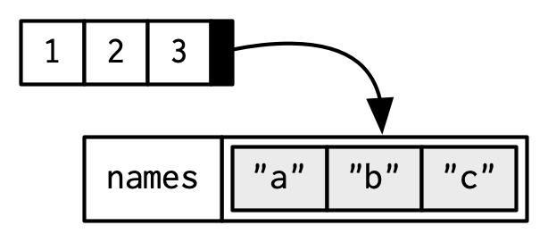

```{r setup, include=FALSE}
knitr::opts_chunk$set(echo = TRUE)
```
Vectors in R can be classified as atomic vectors and lists (recursive vectors). We will start with the former here.

## Atomic Vectors
1. Atomic vectors can be thought of as contiguous cells containing homogeneous/same types of data. 
There are six basic/atomic vector types: **logical, integer, real/numeric/double, character, complex, and raw (byte)**.  
  
See diagram representation of atomic vectors:
  
2. Atomic vectors are always flat.

## Create vectors 
1. Using the function _c()_ with or without names
Named vectors are useful, because they can be used as lookup tables.

```{r}
x <- c(1, 3, 5, 7)  # real vector
y <- c(TRUE, FALSE, TRUE)  #logical vector
z <- c(1L, 2L, 10L) # integer vector
j <- c('a', 'b', 'c')  # character

# try to create a vector of different data types
# if combine different type of data, they will be coerced to the most flexible type.
k <- c('a', 'b', 1, TRUE)

# always flaten out
h <- c(1, c(2:5))

# Three ways to Create named vectors
# Although Names don't have to be unique, it will be most useful if they are unique
# Not all elements of a vector needs to have a name.
# 1. while creating, name it
sex <- c(female = 1, male = 0)
prices <- c(apple = 0.99, pear =1.20, banana = 0.49)

# 2. Give name after creating the vector in place
prices <- c(0.99, 1.20, 0.49)
names(prices) <- c("apple", "pear", "banana")

# 3. Creating a modified copy of a vector
prices <- setNames(c(0.99, 1.20, 0.49), c("apple", "pear", "banana"))

# non-unique names
prices <- c(apple = 0.99, pear = 1.20, pear = 0.49)

# some missing names
prices <- c(apple = 0.99, pear = 1.20, 0.49)
names(prices)
# no names at all
prices <- c(0.99, 1.20, 0.49)
names(prices)

# remove names of a vector using unname()
unname(prices)
names(x) <- NULL

# c can be ommited if only single value
single_value_vector <- 1
```
2. Using sequence generators, which return vectors
```{r}
y <- 1:10
y <- 10:1
x <- seq(10) 
x <- seq(1, 10, 1)
z <- seq_along(y)
j <- seq.int(from = 1, to = 10, by = 1)
k <- seq_len(10)
```

3. Using vector() to create empty vector of specified type
```{r}
# Pre-allocate a memory chuck for later use for speed
x <- vector(mode = "numeric", length = 10)
```
## Check data type of a vector and coerce its type
```{r}
x <- 1:10
is.numeric(x)
is.logical(x)
is.character(x)
is.double(x)
is.atomic(x)

# is.vector() returns true only if the object is a vector with no attributes 
# other than names
is.vector(x)

# to test if an objector is a vector, using
is.atomic(x) || is.list(x)

# Although Coercion often happens automatically if possible, explicit coercion is
# necessary in some cases to avoid nonesense
# Most mathematical functions (+. -, log, etc) will coerce to a numeric, while most
# logcal operations (&, |, any, all, etc) will coerce to a logical.
# If the coercion lose information, a warning message will be thrown.

as.numeric(x)
as.logical(x)
as.character(x)
as.vector(x)

# logical converted to numeric: TRUE -> 1, FALSE -> 0
1 + TRUE

# you can add numbers to characters
try({
   1 + 'a' 
})
```

## Access attributes of vectors: Type, length and attributes
Attributes are stored as a named list associated with an object.
```{r}
x <- 1:3

## vector length: number of elements in the vector
length(x)

# type of x
typeof(x)

# attributes: additional arbitary metadata
attributes(x) 
attributes(x) <- list(x = "abcdef", y = 4:6)

names(x) <- letters[1:3]
attributes(x)
```
Diagram representation of attributes of vector:  
  


## Indexing and subsetting vectors
```{r}
x <- 1:10

# using positive integer to index
x[7]

# 
x[1:5]
x[c(1,3,5)]

# using negative integer to index
# removing the elements at specified index
x[-1]

# using logical
x[x > 5]

# using names to index
prices <- c(apple = 0.99, pear = 1.20, banana = 0.49)
prices["apple"]

# You can't using mixed types of indexing
x[c( x > 5, 2)]
```

## Modify elements of vectors
```{r}
x <- 1:10

# replace elements in place
x[2:5] <- c(13, 14, 15, 20)
x

# replace elements by subsetting and combining
y <- c(x[1], c(13, 14, 15, 20), x[6:10])
y

# insert elements
y <- c(x[1:2], 30, x[3:10])

# appending new elements
z <- c(x, c(20:25))
z
```
