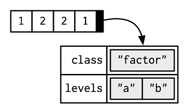

```{r include = FALSE}
knitr::opts_chunk$set(echo = TRUE, eval=TRUE, fig.width = 4, 
                      fig.height = 5, warning = FALSE, 
                      message = FALSE, encoding = "UTF-16")

```


A factor is a vector containing only predefined values, and is used to store categorical data(gender, social class, etc).

Factor are built on top of integer vectors, using two essential attributes:  

* The class "factor", which makes them behave differently from regular integer vectors
* The levels attribute, which defines the set of allowed values.  
  


You CANNOT directly add other undefined values to a factor vector, which leads to NA.  
You CANNOT directly combine factors.

A excellent R package, forcats, provides friendly functionalities to handle factors. See a [cheat sheet](https://github.com/rstudio/cheatsheets/raw/master/factors.pdf).

## Create factors using _factor()_ function

```{r}
genomic_features <- factor(c("5_prime_UTR", "CDS", "3_prime_UTR", "intron"))
genomic_features
class(genomic_features)

# By default, using alphanumeric order, aka, ASCII Sort Order Chart (http://support.ecisolutions.com/doc-ddms/help/reportsmenu/ascii_sort_order_chart.htm): 
levels(genomic_features)

# NA added
genomic_features[2] <- "exon"
genomic_features

nucleotides <- factor(c("A", "T", "C", "G"))
c(genomic_features, nucleotides)
```

## Coerce vectors of other object types into factors and change factors to other types
```{r}
x <- c('a', 'b', 'c')

# convert the character vector to factor
x <- as.factor(x)
x

# convert back to a character vector
y <- as.character(x)
y

# convert factor back to an integer vector
x <- c(1, 4, 3, 6, 9)
x

x <- as.factor(x)
x

# Correct way
y <- as.numeric(as.character(x))
y

# Wrong way
z <- as.numeric(x)
```
## Converting a numeric vector into a factor vector using the _cut()_ function
```{r}
?cut

wfact = cut(women$weight,3)
table(wfact)

# add labels
wfact = cut(women$weight,3,labels = c('Low','Medium','High'))
wfact

table(wfact)
```


## Change the order of levels and labels of factors
```{r}
# pig chromosomes
chromosomes <- factor(c(1:10, "X", "Y", "MT", 11:18))
chromosomes
# reorder the chromosome levels and give more meaningful labels
chromosomes <- factor(chromosomes, levels = c(1:18, "X", "Y", "MT"), 
                     labels = c(paste0("chr", c(1:18, "X", "Y", "MT"))))
chromosomes
levels(chromosomes)
```

### Ways to modify factors
```{r}
# add levels to a factor
nucleotides <- factor(c("A", "T", "C", "G"))
nucleotides
nucleotides <- factor(c(as.character(nucleotides), "U"))
nucleotides

# remove levels from a factor
nucleotides <- factor(c("A", "T", "C", "G"))
nucleotides
nucleotides <- factor(as.character(nucleotides)[-2])
nucleotides
# or use subsetting and factor again
nucleotides <- factor(c("A", "T", "C", "G"))
# drop the removed levels
nucleotides <- nucleotides[-2, drop = TRUE]
nucleotides

# modify levels first
nucleotides <- factor(c("A", "T", "C", "G"))
levels(nucleotides) <- c(levels(nucleotides), "U")
nucleotides[5] <- "U"
nucleotides
nucleotides[3] <- "U"
nucleotides

```
### Access elements of factors
Same to regular atomic vector indexing, except levels attribute does NOT change

```{r}
x <- factor(c("single","married","married","single"))

x[3]           # access 3rd element

x[c(2, 4)]     # access 2nd and 4th element

x[-1]          # access all but 1st element

x[c(TRUE, FALSE, FALSE, TRUE)]  # using logical vector
```
