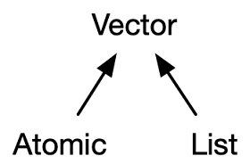
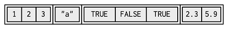
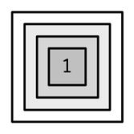
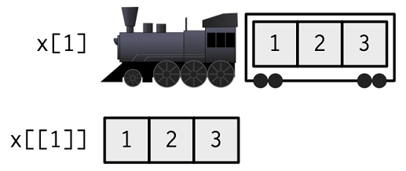
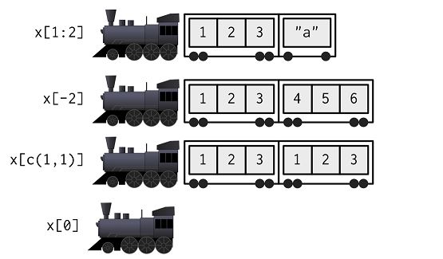

```{r include = FALSE}
knitr::opts_chunk$set(echo = TRUE, eval=TRUE, fig.width = 4, 
                      fig.height = 5, warning = FALSE, 
                      message = FALSE, encoding = "UTF-16")
```

Lists are also called recursive vectors because a list can contain other list. Their elements can be of any type of R object, including lists.  
Lists are used to build up more complicated data structures in R. Generally used for complex objects returned by R functions.  
  

## Create a list using _list()_ function

```{r}
list_1 <- list(
  1:3, 
  "a", 
  c(TRUE, FALSE, TRUE), 
  c(2.3, 5.9)
)

list_1

list_2 <- list(list(list(1)))
str(list_2)
```

## Create a list from other data structure using as.list()
```{r}
a <- 1:3
as.list(a)
```
A simplified diagram representation of list_1:  
  
A simplified diagram representation of the recursive list_2:  
 


## Combine lists using _c()_ function
c() will combine several lists into one. If given a combination of atomic vectors and lists, c() will coerce the vectors to lists before combining them.
```{r}
l4 <- list(list(1, 2), c(3, 4))  # nested list
l5 <- c(list(1, 2), c(3, 4))  # flaten into a list of length 4
str(l4)
str(l5)
```
A diagram representation of lists x and y:  
 

## Check type of lists, and test type
```{r}
x <- list(1:3, "a", c(TRUE, FALSE, TRUE), c(2.3, 5.9))
typeof(x)

is.list(x)
```

## Convert a list to an atomic vector using unlist()
Names of list will be missing when apply _unlist()_.
```{r}
x <- list(1:3, "a", c(TRUE, FALSE, TRUE), c(2.3, 5.9))
unlist(x)
```

## Indexing list
Attention should be paid to the different ways to indexing lists, especially the difference between "[]" and "[[]]".

>"If list x is a train carrying objects, then x[[1]] is the object in car 1; x[2:3] is a train of cars 2-3."  
>- @RLangTip

A diagram representation of different subsetting of lists: 
  
Diagram representations of x[1] and x[[1]]:  
  
Diagram representations of x[1:2], x[-2], x[c(1,1)] and x[0]:
  

```{r}
x <- list(1:3, "a", c(TRUE, FALSE, TRUE), c(2.3, 5.9))

# using "[[]]"
x[[1]]

# using "$" if the list is named
x <- list(integer = 1:3, string = "a", logical =c(TRUE, FALSE, TRUE), numeric = c(2.3, 5.9))
x$integer

# using "[]", usually this is not what you want
# It return a sublist, instead of an element of the list

x[1]
x["integer"]

# Subset list to get elements out of a list
# To extract individual elements out of a specific list item combine the [[ (or $) operator with the [ operator:
x[[1]][1]


# Subset list with a nested list
nested_list <- list(item1 = 1:3, 
                    item2 = list(item2a = letters[1:5], 
                                 item3b = c(T, F, T, T)))
nested_list[[2]][[1]][3]
nested_list[["item2"]][["item2a"]][1]
rm(x)
```

## Modifying a list
```{r}
# add elements to a list
x <- list(integer = 1:3, string = "a", numeric = c(2.3, 5.9))
x$logical <- c("TRUE", "FALSE", "TRUE")
x[5] <- list("b")
## same as the last one
x[5] <- "b"

# remove elements from a list
x <- x[-1]
x

x[[2]] <- NULL  # or x[2] <- NULL
x

# replace elements in a list
x <- list(integer = 1:3, string = "a", numeric = c(2.3, 5.9))
x[1] <- list(integer = 2:6)
x
```
