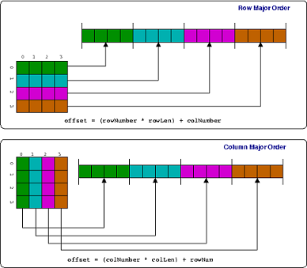
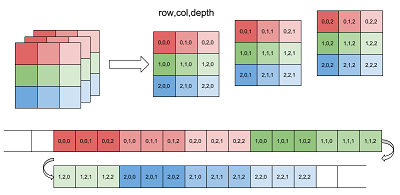

```{r setup, include=FALSE}
knitr::opts_chunk$set(echo = TRUE)
```

## Matrix  
* Matrices and arrays are implemented as vectors with special attributes: dimension.  
* Every element must have the SAME type.  
* By default, matrices are filled in a column-major order.  
* It is a common data structure in math.  
  

### Create a matrix from a set of values using the function _matrix()_
```{r eval = FALSE}
?matrix
matrix(data = NA, nrow = 1, ncol = 1, byrow = FALSE,
       dimnames = NULL)
```

```{r}
# fill in a matrix in a column-major order by default
# fill in a matrix in a row-major order if set byrow = TRUE
num_mat <- matrix(1:10, nrow = 2, ncol = 5, byrow = FALSE, dimnames = NULL)
num_mat

# infer the number of columns or rows when one of them is given
num_mat <- matrix(1:10, nrow = 2, byrow = FALSE, dimnames = NULL)
num_mat

# recycle values if only one value is specificed. In this case, both dimensions
# should be specified.
num_mat <- matrix(0, nrow = 2, ncol =5, byrow = FALSE, dimnames = NULL)
num_mat

# recycle values if the number of values is not a submulptile or multiple of 
# the number of rows or colums (depends the way matrices are filled in). A
# warning message is thrown.
num_mat <- matrix(1:9, nrow = 2, ncol = 5, byrow = FALSE, dimnames = NULL)
num_mat

# create a single value matrix
num_mat <- matrix(1)
```

### Coerce other data structures into matrices if possible using the function _as.matrix_.
```{r}
warpbreaks[1:10,]
as.matrix(warpbreaks[1:10,])
```
### Create a matrix by adding a dim() attribute to an atomic vector
```{r}
a <- 1:10

# create a 2 X 5 matrix
dim(a) <- c(2,5)
a
```
### Combine multiple vectors of same length into a matrix using _cbind()_ or _rbind()_.
```{r}
a <- 1:5
b <- 6:10
c <- 11:15

# byrow
rbind(a, b, c)

# bycol
cbind(a, b, c)
```


### Subset, index and modify a matrix
```{r}
num_mat <- matrix(1:20, nrow = 4, byrow = FALSE, dimnames = NULL)
num_mat

# get row 1
num_mat[1, ]  # same as num_mat[1, 1:5]

# get column 2
num_mat[, 2]  #same as num_mat[1:4, 2]

# get elements in a contguous region
num_mat[1:3, 2:4]

# Get a single values at row 2, column 3
num_mat[2, 3]


# replace elements in a matrix by subsetting assignment
# The number of items to replace should be a multiple of replacement length
num_mat[2, 3] <- 100
num_mat

num_mat[1:2, 3] <- 100
num_mat

# error
try({num_mat[1:4, 3] <- 30:37})

# recyle o for 4 times
num_mat[1:4, 3] <- 0
num_mat

# recycle 0, 1 twice.
num_mat[1:4, 3] <- c(0,1)
num_mat
```

### Test if an object is a matrix
```{r}
num_mat <- matrix(1:20, nrow = 4, byrow = FALSE, dimnames = NULL)
is.matrix(num_mat)
```

### Check mode, type and structure of a matrix
```{r}
num_mat <- matrix(1:20, nrow = 4, byrow = FALSE, dimnames = NULL)
mode(num_mat)
typeof(num_mat)
str(num_mat)
```
### Attribute of Matrices  
A matrix has attributes, such as names (same as col.names), row.names, dim, and class.
```{r}
num_mat <- matrix(1:20, nrow = 4, byrow = FALSE, 
                  dimnames = list(row = LETTERS[1:4], col = letters[5:9]))
# get column names
colnames(num_mat)

# get row names
rownames(num_mat)

# get both row and column names
dimnames(num_mat)

# get dimensions for a data frame 
nrow(num_mat)
ncol(num_mat)  # same as length(num_mat)
dim(num_mat)
```

## Array  
* Matrices are 2-D arrays.  
* Arrays are multidimensional (dim >= 2).  
* All elements must of the SAME type.  
* Arrays with more than 2 dimension are rarely used due to intuitively difficulty. Avoid them if possible.  
  

### Create a array using the function _array()_
```{r}
array_1 <- array(1:12, dim = c(2, 3, 2))
array_1
```
### Attributes and properties of matrices and arrays
```{r}
num_mat <- matrix(1:20, nrow = 4, byrow = FALSE, dimnames = NULL)

# matrix with an attribute: dim
attributes(num_mat)

# length: number of elements in a matrix
length(num_mat)

# dimension: number of columns and rows
ncol(num_mat)
nrow(num_mat)
dim(num_mat)

#  get and assign dimension names
# The dimnames of a matrix or array can be NULL (which is not stored) or a list of the same length as dim(x). If a list, its components are either NULL or a character vector with positive length of the appropriate dimension of x. The list can have names. It is possible that all components are NULL: such dimnames may get converted to NULL.
rownames(num_mat)
colnames(num_mat)
dimnames(num_mat)

rownames(num_mat) <- LETTERS[1:4]
colnames(num_mat) <- LETTERS[5:9]
dimnames(num_mat) <- list(letters[1:4], letters[5:9])
```