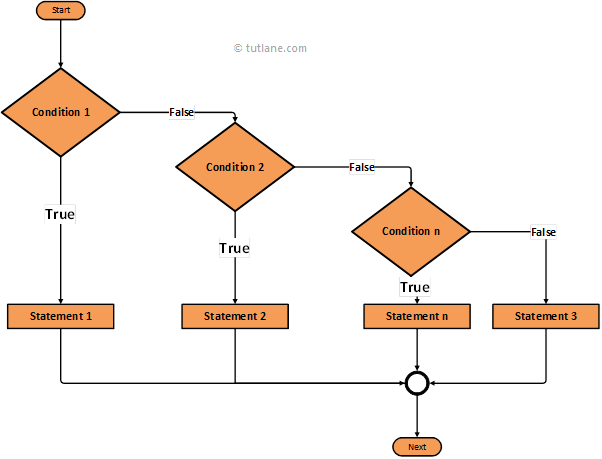
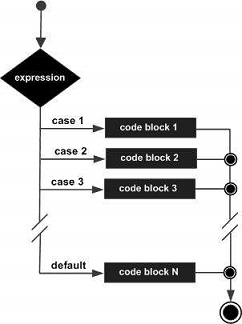
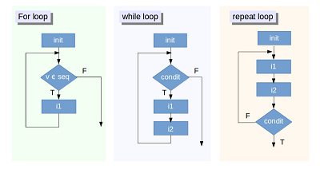

```{r include = FALSE}
knitr::opts_chunk$set(echo = TRUE, eval = TRUE, fig.width = 4, 
                      fig.height = 5, warning = FALSE, 
                      message = FALSE, encoding = "UTF-16")
```

## Control flow  
There are two primary tools of control flow: choices and loops. Choices, like **if** statements and **switch()** calls, allow you to run different code depending on the input. Loops, like **for** and **while**, allow you to repeatedly run code, typically with changing options . It is more efficient to use built-in functions rather than control structures whenever possible.

### Choices
1. **if-else** statement  
**Attention**:  
* Curly brace before **else** must be in the same line as **else**.  
* The condition should evaluate to a single TRUE or FALSE.  
Syntax  
```{r eval = FALSE}
if (cond)
{
    expr
}
 
if (cond) 
{
    expr1
} else {
    expr2
}

# The if-else ladder (if-else if) statement allows you execute a block of code among more than 2 alternatives

if (cond1) 
{
    expr1
} else if (cond2)
{
    expr2
} else {
    expr3
}
```
  

Examples using if-else statement:  
```{r}
# if statement
x <- 5
if (x > 0)
{
    print("Positive number")
}

# if-else statement
x <- -5
if (x > 0)
{
    print("Non-negative number")
} else {
    print("Negative number")
}

# Error
try({
  if (x > 0)
  {
     print("Non-negative number")
  } 
  else                                # not valid syntax
  {
     print("Negative number")
  }
})

# nested if-else statements
x <- 0
if (x < 0) 
{
    print("Negative number")
} else if (x > 0) 
{ 
    print("Positive number")
} else {
    print("Zero")
}
```
2. Swith() function  

It's a compact, special purpose equivalent to if-else statement.  
The switch() function returns the corresponding item to the numeric value evaluated, like indexing a vector.  
If the numeric value is out of range (greater than the number of items in the list or smaller than 1), then NULL is returned.  
The expression used in the switch () function can be a string as well. In this case, the **matching named item's value** is returned, like indexing a named vector.  

```{r eval = FALSE}
switch(expr, ...)
```
```{r}
x <- switch(2,"red","green","blue")
x

x <- switch(4,"red","green","blue")
x

X <- switch("color", "color" = "red", "shape" = "square", "length" = 5)
x

switch("length", "color" = "red", "shape" = "square", "length" = 5)


## replace if-else with switch()
x_option <- function(x) {
  if (x == "a") {
    "option 1"
  } else if (x == "b") {
    "option 2" 
  } else if (x == "c") {
    "option 3"
  } else {
    stop("Invalid `x` value")
  }
}

x_option <- function(x) {
  switch(x,
    a = "option 1",
    b = "option 2",
    c = "option 3",
    stop("Invalid `x` value")
  )
}
```
3. Vectorized ifelse()  
**if** only works with a single TRUE or FALSE, while **ifelse()** can handle vectors of values. Note missing values will be propagated into the output.  
Use **ifelse()** only when the yes and no vectors are the same type as it is otherwise hard to predict the output type. See https://vctrs.r-lib.org/articles/stability.html#ifelse for additional discussion.  
Another vectorized equivalent is the more general dplyr::case_when(). It uses a special syntax to allow any number of condition-vector pairs.  
These two vectorized functions are very useful for changing values in a vector, a column of matrices and data frames.  

```{r}
x <- 1:10
ifelse(x %% 5 == 0, "XXX", as.character(x))
ifelse(x %% 2 == 0, "even", "odd")

dplyr::case_when(
  x %% 35 == 0 ~ "fizz buzz",
  x %% 5 == 0 ~ "fizz",
  x %% 7 == 0 ~ "buzz",
  is.na(x) ~ "???",
  TRUE ~ as.character(x)
)
```

### Loops  
  
1. **For** loop  
**for** loops are used to iterate over items in a vector. Use a **for** loop, if you know how many iterations it will run in advance.  

There are two ways to terminate a for loop early:  
* **next** exits the current iteration and go to the next iteration.  
* **break** exits the entire **for** loop.  


```{r eval = FALSE}
for (var in seq) 
{
    expr
}
```
> The seq in a for loop is evaluated at the start of the loop; changing it subsequently does not affect the loop. If seq has length zero the body of the loop is skipped. Otherwise the variable var is assigned in turn the value of each element of seq. You can assign to var within the body of the loop, but this will not affect the next iteration. When the loop terminates, var remains as a variable containing its latest value.


```{r}
# Read  for documentation
?`for`


for (i in 1:10) 
{
   if (i < 5)
   {
       print(i)
   } else if (i < 8) {
       next
   } else {
       break
   }
}
```

**for** loops can be nested inside of each other.
```{r}
x <- matrix(1:6, 2, 3)

for(i in seq_len(nrow(x)))
{
    for(j in seq_len(ncol(x)))
    {
        print(x[i, j])
    }   
}
```

**Attention**: Common pitfalls of using **for** loops  
There are three common pitfalls to watch out for when using **for** loops:  

* First, if you're generating data, make sure to preallocate the output container. Otherwise the loop will be very slow.  
```{r}
means <- c(1, 50, 20)
out <- vector("list", length(means))
for (i in 1:length(means)) {
  out[[i]] <- rnorm(10, means[[i]])
}
```
* Next, beware of iterating over 1:length(x), which will fail in unhelpful ways if x has length 0. This occurs because **:** works with both increasing and decreasing sequences. Use seq_along(x) instead. It always returns a value the same length as x.  
```{r}
means <- c() # NULL
out <- vector("list", length(means))
try({
  for (i in 1:length(means)) 
  {
    out[[i]] <- rnorm(10, means[[i]])
  }
})

1:length(means)
seq_along(means)

out <- vector("list", length(means))
for (i in seq_along(means)) {
  out[[i]] <- rnorm(10, means[[i]])
}
```
* Finally, you might encounter problems when iterating over S3 vectors, as loops typically strip the attributes. Work around this by calling [[ ]].  

```{r}
xs <- as.Date(c("2020-01-01", "2010-01-01"))
for (x in xs) {
  print(x)
}

for (i in seq_along(xs)) {
  print(xs[[i]])
}
```

2. **While** loop  
Use a **while** loop, if you don't know how many iterations it will run in advance.  
Attention: Remember to update testing condition to avoid infinite looping.  

```{r eval = FALSE}
while (cond)
{
    expr
}
```
```{r eval = FALSE}
i <- 10
while (i > 0)
{
    print(paste(i, "is positive!"))
    i <- i - 1                        # inifite loop without this line 
}
```

3. **Repeat** loop  
Very similar to the **while** loop. But it iterate at least once.  
```{r eval = FALSE}
repeat {
    statement
}
```
```{r}
x <- 1
repeat {
    print(x)
    x = x + 1
    if (x == 6) 
    {
        break
    }
}
```

4. Exercises  
Write a for loop to get the sum of integers from 1 to 10.