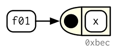
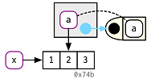
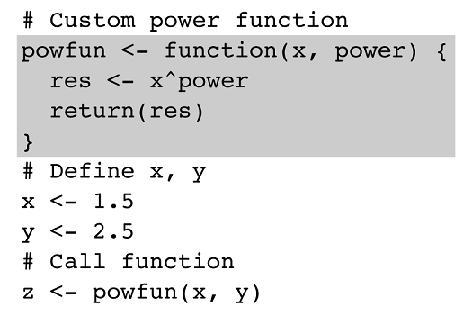
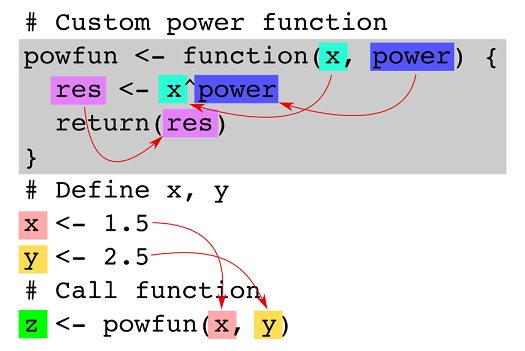
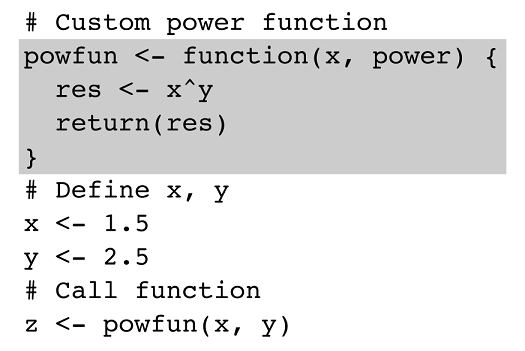
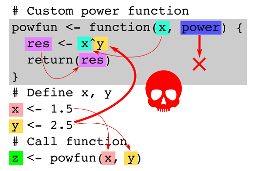

```{r include = FALSE}
knitr::opts_chunk$set(echo = TRUE, eval = TRUE, fig.width = 4, 
                      fig.height = 5, warning = FALSE, 
                      message = FALSE, encoding = "UTF-16")
```

A function is a block of organized, reusable code that is used to perform a single, related action. Functions are a fundamental building blocks of R. And R functions are also objects. 
A function should be written to  

* carry out a specified task;  
* may or may not include arguments;  
* contain a body;  
* may or may not return one or more values.  

Functions provide **better modularity** for your application and a higher degree of **code reusability**.

## Overview of functions

The structure of a function is given below.
```{r eval = FALSE}
function_name <- function(arg1, arg2, ... )
{
    statements
    return(object)
}
```

All R functions written in the R language have three parts:  

* the body(), the code inside the function.  
* the formals(), the list of arguments which controls how you call it.  
* the environment(), which determines how variables referred to inside the function are found. 

To examine the arguments to a function, you can use the _args()_ function, as an alternative to _formals()_.  
```{r}
args(mean)
```

Some exceptions: In R base package, some functions are written in C code for better performance, such as the **sum()** function. They are primitive functions, whose formals(), body(), environment() are all NULL.

## Create functions
In R, you simply create a function object (with function) and bind it to a name with <-:  

  

```{r}
f <- function(x)
{
    x^2
}

f

# You can change functions by assigning new values to them.
formals(f)

body(f)
body(f) <- "x^3"
f

environment(f)
```
**Attention**:  
* Objects in the function are local to the function.  
* Functions can also have attributes. And you can add attributes to a function.  

**Anonymous functions**: While you almost always create a function and then bind it to a name, the binding step is not compulsory. If you choose not to give a function a name, you get an anonymous function. This is useful when it's not worth the effort to figure out a name:
```{r}
lapply(mtcars, function(x) length(unique(x)))
Filter(function(x) !is.numeric(x), mtcars)
integrate(function(x) sin(x) ^ 2, 0, pi)
```

You can put functions in a list:
```{r}
  funs <- list(
  half = function(x) x / 2,
  double = function(x) x * 2
)

funs$double(10)
```

## Invoking/calling a function
You normally call a function by placing its arguments, wrapped in parentheses, after its name. 
```{r}
# calculate mean of a vector
mean(c(1:10, NA), na.rm = TRUE)
```
The name-value binding and copy-on-modify rules apply to function calls, also. See an example and diagram representation of the function call.  
```{r}
f <- function(a) {
  a
}

x <- c(1, 2, 3)
z <- f(x)
```
A diagram showing name-value binding during function f() is called.  
  

After function call finished, we will have z  and x binds to the same vector.  
  

What will happen if we modify a during the function call?  

```{r}
f <- function(a) {
  a[2] <- 5
  a
}

x <- c(1, 2, 3)
z <- f(x)
```

But what happens if you have the arguments already in a data structure?  
You can instead use _do.call()_: it has two arguments. The function to call, and a list containing the function arguments:
```{r}
args <- list(1:10, na.rm = TRUE)
do.call(mean, args)
```

## Lexical scoping
Scoping is the set of rules that govern how R looks up the value of a name/symbol. Understanding scoping allows you to be a advanced user and developer of R applications.  

* build tools by composing functions  
* overrule the usual evaluation rules and do non-standard evaluation. 

R has two types of scoping:  

* Lexical scoping -- also called static scoping, implemented **automatically** at the language.
* Dynamic scoping -- used in the **select()** function to save typing during **interactive analysis**.

Lexical scoping looks up symbol values based on how function were nested when they were created, **NOT** how they are nested when they are called. With lexical scoping, users only need to look at the function's definition.

See this example: 
  
<br/>
  
<br/>
  


There are four basic principles behind R's implementation of lexical scoping:  

* Name masking (aka shadowing)
* Functions vs. variables
* A fresh start
* Dynamic lookup

### Name masking (aka shadowing)
Understanding the most basic principle of lexical scoping with the following examples.  
```{r}
x <- 10
f <- function(){
    x <- 1   # x outside the function is masked
    y <- 2
    c(x, y)
}
f()

rm(f)
```
If a name is not defined inside a function, R will look one level up.
```{r}
x <- 2
g <- function(){
    y <- 2
    c(x, y)
}
g()

rm(g)
```

The same rules apply if a function is defined inside another function: the value of a name will be first look inside the current function, then where that function was defined and so on, all the way up to the global environment, and then on the other loaded packages (see them by run **search()**).  

Run the following code in your head, then confirm the result by running the code.
```{r}
x <- 1
g04 <- function() {
  y <- 2
  i <- function() {
    z <- 3
    c(x, y, z)
  }
  i()
}
g04()
```

### Functions versus variables
* Finding functions work exactly the same way as finding variables.  
* R will ignore objects that are not functions when it is searching for functions, because functions and variable names are stored in different namespaces.  
* To avoid confusion, don't use the same names for functions and other objects.  
```{r}
g09 <- function(x) x + 100
g10 <- function() {
  g09 <- 10
  g09(g09)
}
g10()
```

### A fresh start
Every time a function is called a new environment is created to host its execution. This means that a function has no way to tell what happened the last time it was run; each invocation is completely independent. After each call, the running environment is destroyed.

```{r}
g11 <- function() {
  if (!exists("a")) {
    a <- 1
  } else {
    a <- a + 1
  }
  a
}

g11()
g11()
```
### Dynamic lookup
Lexical scoping determines where, but not when to look for values. R looks for values when the function is run, not when the function is created. Together, these two properties tell us that the output of a function can differ depending on the objects outside the function's environment.

```{r}
g12 <- function() x + 1
x <- 15
g12()

x <- 20
g12()
```

The _codetools::findGlobals()_ function lists all the external dependencies (unbound symbols, not provided by function's arguments) within a function.
```{r}
codetools::findGlobals(g12)
```
To solve this problem, you can manually change the function's environment to the emptyenv(), an environment which contains nothing. This will isolate the function from other potential interfering environment. Or don't use unbound symbols in a function at all.

```{r}
environment(g12) <- emptyenv()
try(g12())
```

## Lazy evaluation
In R, function arguments are lazily evaluated: they're only evaluated if accessed. Compare the two functions.

```{r}
h01 <- function(x){
  10
}
h01(x = stop("This is an error!"))


h02 <- function(x){
  x
  10
}
try({
  h02(x = stop("This is an error!"))
})
```
Try the following two function calls, and see why different results are returned.
```{r}
y <- 10
h02 <- function(x) {
  y <- 100
  x + 1
}

h02(y)
h02(y <- 1000)
```
Then run the following code in your mind, and then run it actually.
```{r}
double <- function(x) { 
  message("Calculating...")
  x * 2
}

h03 <- function(x) {
  c(x, x)
}

h03(double(20))
```
This property allows you to do things like include potentially expensive computations in function arguments that will only be evaluated if needed.

### Lazy evaluation for default arguments  
Thanks to lazy evaluation, default values can be defined in terms of other arguments, or even in terms of variables defined later in the function.  
Many base R functions use this technique, but I don't recommend it. It makes the code harder to understand: to predict what will be returned, you need to know the exact order in which default arguments are evaluated.
```{r}
h04 <- function(x = 1, y = x * 2, z = a + b) {
  a <- 10
  b <- 100
  
  c(x, y, z)
}

h04()
```
Default arguments are evaluated inside the function, but user-supplied arguments are evaluated outside the function. This means that seemingly identical calls can yield different results.  
```{r}
h05 <- function(x = ls()) {
  a <- 1
  x
}

# Use the default argument,and ls() evaluated inside h05:
h05()

# Use user-supplied arguments, so ls() evaluated in global environment:
h05(ls())
```

### Missing arguments
To determine if an argument's value comes from the user or from a default, you can use missing():
```{r}
h06 <- function(x = 10) {
  list(missing(x), x)
}
str(h06())

str(h06(10))
```
missing() is best used sparingly, however. Take _sample()_, for example. How many arguments are required?
```{r}
args(sample)
```
It looks like both **x** and **size** are required, but if **size** is not supplied, sample() uses missing() to provide a default. It is better to use an explicit **NULL** to indicate that **size** is not required but can be supplied:
```{r}
sample <- function(x, size = NULL, replace = FALSE, prob = NULL) {
  if (is.null(size)) {
    size <- length(x)
  }
  
  x[sample.int(length(x), size, replace = replace, prob = prob)]
}
```  
## ... (dot-dot-dot) argument  
Functions can have a special argument ... (pronounced dot-dot-dot). With it, a function can take any number of additional arguments. The ... argument is necessary when the number of arguments passed to the function cannot be known in advance. The ... argument is often used when extending another function and you don't want to copy the entire argument list of the original function.  

You can use ... to pass those additional arguments on to another function.

```{r}
i01 <- function(y, z) {
  list(y = y, z = z)
}

i02 <- function(x, ...) {
  i01(...)
}

str(i02(x = 1, y = 2, z = 3))
```
Inside the function, to capture the arguments passed by ..., use list(...), which evaluates the arguments and stores them in a list:
```{r}
i04 <- function(...) {
  list(...)
}
str(i04(a = 1, b = 2))
```

There are two primary uses of ...:  

1. If your function takes a function as an argument, you want some way to pass additional arguments to that function. In this example, lapply() uses ... to pass na.rm on to mean():
```{r}
x <- list(c(1, 3, NA), c(4, NA, 6))
str(lapply(x, mean, na.rm = TRUE))
```
2. If your function is an S3 generic, you need some way to allow methods to take arbitrary extra arguments. 

Using ... comes with two downsides:

When you use it to pass arguments to another function, you have to carefully explain to the user where those arguments go. This makes it hard to understand what you can do with functions like lapply() and plot().

A misspelled argument will not raise an error. This makes it easy for typos to go unnoticed:
```{r}
sum(1, 2, NA, na_rm = TRUE)
```
### Exercise  

1. Explain the following results by reading the documentation of functions: ?sum, and ?mean.
```{r}
sum(1, 2, 3)
mean(1, 2, 3)
sum(1, 2, 3, na.omit = TRUE)
mean(1, 2, 3, na.omit = TRUE)
```
2. Explain how to find the documentation for the named arguments in the following function call:
```{r}
plot(1:10, col = "red", pch = 20, xlab = "x", col.lab = "blue")
```
## Exiting a function
Most functions exit in one of two ways: they either return a value, indicating success; or they throw an error, indicating failure.  This section describes return values (implicit versus explicit; visible versus invisible), briefly discusses errors, and introduces exit handlers, which allow you to run code when a function exits.  

### Implicit versus explicit returns  
There are two ways that a function can return a value:

1. Implicitly, where the last evaluated expression is the return value:
```{r}
j01 <- function(x) {
  if (x < 10) {
    0
  } else {
    10
  }
}
j01(5)

j01(15)
```
2. Explicitly, by calling return():  
```{r}
j02 <- function(x) {
  if (x < 10) {
    return(0)
  } else {
    return(10)
  }
}
```
**Attention**:  

* The **single** object returned can be any data type. To return **multiple** objects, build a list or S4/R6 object.  

* A **return** statement is not necessary to return something. since by default, R functions return the results of the last evaluation in their body. explicit **return()** statements are reserved for cases when you are returning early, such as for an error, or a simple case of the function.  

### Return invisible values
Most functions return visibly: calling the function in an interactive context prints the result.

```{r}
j03 <- function() 1
j03()
```
However, you can prevent automatic printing by applying invisible() to the last value:
```{r}
j04 <- function() invisible(1)
j04()
```
To verify that this value does indeed exist, you can explicitly print it or wrap it in parentheses:
```{r}
print(j04())

(j04())
```
Alternatively, you can use withVisible() to return the value and a visibility flag:
```
str(withVisible(j04()))
```
The most common function that returns invisibly is <-:
```{r}
a <- 2
(a <- 2)
```
This is what makes it possible to chain assignments:
```{r}
a <- b <- c <- d <- 2
```
In general, any function called primarily for a side effect (like <-, print(), or plot()) should return an invisible value (typically the value of the first argument).  

### Errors
If a function cannot complete its assigned task, it should throw an error with stop(), which immediately terminates the execution of the function. An error indicates that something has gone wrong, and forces the user to deal with the problem.  
```{r}
j05 <- function() {
  stop("I'm an error")
  return(10)
}
try(j05())
```

### Exit handlers
Sometimes a function needs to make temporary changes to the global state. To ensure that these changes are undone and that the global state is restored no matter how a function exits, use on.exit() to set up an exit handler.  

```{r}
j06 <- function(x) {
  cat("Hello\n")
  on.exit(cat("Goodbye!\n"), add = TRUE)
  
  if (x) {
    return(10)
  } else {
    stop("Error")
  }
}

j06(TRUE)
try(j06(FALSE))
```
> Always set add = TRUE when using on.exit(). If you don't, each call to on.exit() will overwrite the previous exit handler. Even when only registering a single handler, it's good practice to set add = TRUE so that you won't get any unpleasant surprises if you later add more exit handlers.  

on.exit() is useful because it allows you to place clean-up code directly next to the code that requires clean-up:
```{r}
cleanup <- function(dir, code) {
  old_dir <- setwd(dir)
  on.exit(setwd(old_dir), add = TRUE)
  
  old_opt <- options(stringsAsFactors = FALSE)
  on.exit(options(old_opt), add = TRUE)
}
```

## Rules of argument matching during invoking/calling functions  
Prefix calls in R are a little special because you can specify arguments in three ways:

* By position, like _help(mean)_.  
* Using partial matching, like _help(top = mean)_.  # "top", short for "topic"  
* By name, like _help(topic = mean)_.  

Arguments are matched in the following order:  

* First by exact name. When specifying the function arguments by name, it doesn't matter in what order you specify them.  
* Then with unique prefixes  
* Finally by position. Positional matching just means that R assigns the first value to the first argument, the second value to second argument, etc. 
* Any arguments that appear after ... on the argument list must be named explicitly and cannot be partially matched or matched by position.

You can mix positional matching with matching by name. When an argument is matched by name, it is "taken out" of the argument list and the remaining unnamed arguments are matched in the order that they are listed in the function definition. Even though it's legal, It is not recommended messing around with the order of the arguments too much, since it can lead to some confusion.  

```{r}
args(sd)

mydata <- 1:20
sd(na.rm = FALSE, mydata)
```

```{r}
k01 <- function(abcdef, bcde1, bcde2) {
  list(a = abcdef, b1 = bcde1, b2 = bcde2)
}
str(k01(1, 2, 3))

str(k01(2, 3, abcdef = 1))

# Can abbreviate long argument names:
str(k01(2, 3, a = 1))

# But this doesn't work because abbreviation is ambiguous
try({str(k01(1, 3, b = 1))})
#> Error in k01(1, 3, b = 1): argument 3 matches multiple formal arguments

# Arguments after ... must be fully named
args(paste)
paste("a", "b", sep = ":")
paste("a", "b", se = ":")

```
**Attention**: General rules of supplying arguments to function calls:  

1. Use positional matching only for the first one or two arguments; they will be the most commonly used, and most readers will know what they are.  
2. Avoid using positional matching for less commonly used arguments, and never use partial matching. Unfortunately you can't disable partial matching, but you can turn it into a warning with the warnPartialMatchArgs option.  

```{r}
options(warnPartialMatchArgs = TRUE)
try({x <- k01(a = 1, 2, 3)})
```
### Summary  

* Functions can be defined using the function() directive and are assigned to R objects just like any other R object.  
* Functions have can be defined with named arguments; these function arguments can have default values.  
* Functions arguments can be specified by name or by position in the argument list.  
* Functions always return the last expression evaluated in the function body.  
* A variable number of arguments can be specified using the special ... argument in a function definition.  


### Exercise  
1. Try this code to find how many functions are in the base package.  
```{r}
objs <- mget(ls("package:base", all.names = TRUE), inherits = TRUE)
funs <- Filter(is.function, objs)
```
2. What does the following function return? Make a prediction before running the code yourself.  
```{r}
f <- function(x) {
  f <- function(x) {
    f <- function() {
      x ^ 2
    }
    f() + 1
  }
  f(x) * 2
}
f(10)
```
