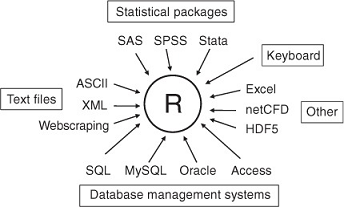
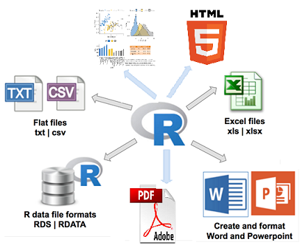
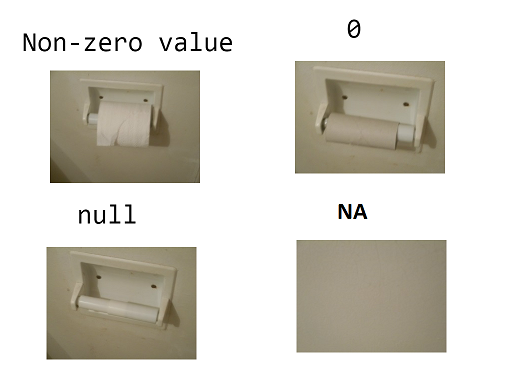

```{r include = FALSE}
knitr::opts_chunk$set(echo = TRUE, eval = TRUE, fig.width = 4, 
                      fig.height = 5, warning = FALSE, 
                      message = FALSE, encoding = "UTF-16")
```

By default, launching R starts an interactive session with input from the keyboard and output to the screen/console. However, you can have input come from a file (data or script, a file containing R commands) and direct output to a variety of destinations.

## Input
R can import data from many different sources.  
  

### Input from the keyboard
We already knew how. This is not efficient at all.
```{r}
# create a data frame from scratch
age <- c(25, 30, 56)
gender <- c("male", "female", "male")
weight <- c(160, 110, 220)
mydata <- data.frame(age,gender,weight)
save(mydata, file = "mydata.RData")
```

### Input from an existing .RData file
We have covered this in "Basics of R programming".
```{r}
load("mydata.RData")
```

### Input from a script file
The source( ) function **runs** a script in the current session.

```{r eval = FALSE}
# Not run
source("DEG analysis.R")
```

### Input from file systems
Usually you will obtain data by importing it from output of SAS, SPSS, Excel, Stata, a database, a webpage, an ASCII file or Excel spreadsheets. We will only cover importing a data frame from an ASCII file or an Excel spreadsheet in this workshop.

For a comprehensive guide, read [R Data Import/Export](https://cran.r-project.org/doc/manuals/r-release/R-data.pdf),  [DataCamp part1](https://www.datacamp.com/community/tutorials/r-data-import-tutorial), and [DataCamp part2](https://www.datacamp.com/community/tutorials/importing-data-r-part-two). 

#### packages for importing file into R  
|Package|File type|
|-------|---------|
|readr|text file|
|haven|SPSS, Stata, and SAS files|
|readxl|excel files (.xls and .xlsx)|
|DBI|databases|
|jsonlite|json|
|xml2|XML|
|httr|Web APIs|
|rvest|HTML (Web Scraping)|


#### Importing rectangular data from text files
Here we use the **readr** package to get rectangular data imported into tibbles. For details, see this [cheatsheet](https://rawgit.com/rstudio/cheatsheets/master/data-import.pdf) and this [link](https://readr.tidyverse.org/). This package is more powerful. Recommended for your daily analysis.

```{r eval = FALSE}
read_*(file, col_names = TRUE, col_types = NULL, locale = default_locale(), na = c("", "NA"), quoted_na = TRUE, comment = "", trim_ws = TRUE, skip = 0, n_max = Inf, guess_max = min(1000, n_max), progress = interactive())

read_csv()     # comma separated (CSV) files
read_csv2()    # Semi-colon delimied files
read_tsv()     # tab separated files
read_delim()   # general delimited files
read_fwf()     # fixed width files
read_table()   # tabular files where columns are separated by white-space.
```
Examples showing useful arguments:   
```{r}
library("readr")
write_file("A,B,C\n1,2,3\n4,5,NA","file.csv")
f <- "file.csv"

# no header
tb_1 <- read_csv(f, col_names = FALSE)
View(tb_1)

# Provide header 
tb_2 <- read_csv(f, col_names = c("x", "y", "z"))

# Skip lines 
tb_3 <- read_csv(f, skip = 1)
# Read in a subset 
tb_4 <- read_csv(f, n_max = 1) 

# Missing Values 
tb_5 <- read_csv(f, na = c("1", "."))
```
readr functions guess the types of each column and convert types when appropriate (but will NOT convert strings to factors automatically). A message shows the type of each column in the result.  

Use problems() to diagnose problems. 

```{r}
x <- read_csv("file.csv"); problems(x)
```
Use a col_ function to guide parsing
```{r}
x <- read_csv("file.csv", col_types = cols( A = col_double(), 
                                            B = col_logical(), 
                                            C = col_factor()))
```
Else, read in as character vectors then parse with a parse_ function.
```{r}
x <- read_csv("file.csv", col_types = 'c')
x$A <- parse_number(x$A)
```

#### Import from Excel spreadsheets
1. A easy way is you can resave your Excel sheets into individual text files.

2. There are quite a few R packages which can be used to import Excel spreadsheets into R. Compared to many of the existing packages (e.g. gdata, xlsx, xlsReadWrite) **readxl** has no external dependencies, so it's easy to install and use on all operating systems. It is designed to work with tabular data. For more instruction, see it [vignette](https://cloud.r-project.org/web/packages/readxl/vignettes/cell-and-column-types.html).

  i) readxl Package  
```{r eval = FALSE}
read_excel(path, sheet = NULL, range = NULL, col_names = TRUE,
col_types = NULL, na = "", trim_ws = TRUE, skip = 0,
n_max = Inf, guess_max = min(1000, n_max),
progress = readxl_progress(), .name_repair = "unique")
```

```{r}
# using the XLConnect package
if (!require("readxl")) install.packages("readxl")
library(readxl)

df <- read_excel("C:\\Users\\Haibo\\BioinformaticsTrainingWorkshop\\2.R\\data/1.3.lib.meta.add.combined.FASTQC.summary-2.xlsx", 
                            sheet = 1, 
                            skip = 4)
```
  ii) openxlsx Package  
  
```{r}
if (!"openxlsx" %in% installed.packages())
{
    install.packages("openxlsx", dependencies = TRUE)
}

library("openxlsx")
df <- read.xlsx("C:\\Users\\Haibo\\BioinformaticsTrainingWorkshop\\2.R\\data/1.3.lib.meta.add.combined.FASTQC.summary-2.xlsx", sheet = 1)
```

## Output  
  

### Non-graphic output
1. The _sink( )_ function defines the direction of the output, except graphics.The **append** option controls whether output overwrites or adds to a file. The **split** option determines if output is also sent to the screen as well as the output file, which is like the **tee** command in Unix.
```{r eval = FALSE}
# direct output to a file
sink("myfile.txt", append = FALSE, split = FALSE) 

# terminate output to the current destination and return output to the terminal
sink()
```

2. Using _save()_ or _save.image()_ to save R objects to a binary .RData file. We have covered this in "Basics of the R programming language" section.

3. Write rectangular data to a file
#### using the **readr** package to save tibbles to a file.
```{r eval = FALSE}
write_delim(x, path, delim = " ", na = "NA", append = FALSE,
  col_names = !append, quote_escape = "double")

write_csv(x, path, na = "NA", append = FALSE, col_names = !append,
  quote_escape = "double")

write_csv2(x, path, na = "NA", append = FALSE, col_names = !append,
  quote_escape = "double")

write_excel_csv(x, path, na = "NA", append = FALSE,
  col_names = !append, delim = ",", quote_escape = "double")

write_excel_csv2(x, path, na = "NA", append = FALSE,
  col_names = !append, delim = ";", quote_escape = "double")

write_tsv(x, path, na = "NA", append = FALSE, col_names = !append,
  quote_escape = "double")

# Object to RDS file 
write_rds(x, path, compress = c("none", "gz", "bz2", "xz"), ...)
```
#### Writing Excel files
There are quite a few packages which can write R data frames into Excel spreadsheet.

1. Using using the XLConnect package (most versatile), depending on Java.
```{r eval = FALSE}
if (!require("XLConnect")) install.packages("XLConnect")

library("XLConnect")
# save a workbook object to a file
saveWorkbook(wbobject, file, overwrite = FALSE)

# 
writeWorksheetToFile(file , styleAction = XLC $ STYLE _ ACTION . XLCONNECT , ...)

# A full example
# multiregion xlsx file from demoFiles subfolder of package XLConnect
demoExcelFile <- system.file("demoFiles/multiregion.xlsx",
                             package = "XLConnect")

# create a copy of the template
template <- "template-ws.xlsx"
file.copy(demoExcelFile, template) 

# Write single data.frame to a specified location in an existing file
writeWorksheetToFile(template, data=iris, sheet="FirstSheet",
                     startRow=9, startCol = 9)

# create a copy of the template
template <- "template-multi-ws.xlsx"

# Write a few copies of the data.frame all over a new file
writeWorksheetToFile(template, data = list(i1 = iris, i2 = iris, i3 = iris),
                     sheet = c("FirstSheet", "SecondSheet", "FirstSheet"),
                     startRow = c(1,101,201), startCol = c(1,11,21))
```


2. Using the openxlsx package to write one or a list of data frame to a file in one shot.

```{r eval = FALSE}
WriteXLS(
  x,
  ExcelFileName = "R.xls",
  SheetNames = NULL,
  perl = "perl",
  verbose = FALSE,
  Encoding = c("UTF-8", "latin1", "cp1252"),
  row.names = FALSE,
  col.names = TRUE,
  AdjWidth = FALSE,
  AutoFilter = FALSE,
  BoldHeaderRow = FALSE,
  na = "",
  FreezeRow = 0,
  FreezeCol = 0,
  envir = parent.frame()
)
```
### Graphic output
To redirect graphic output use one of the following functions.
ATTENTIO: Use **dev.off( )** to shuts down the specified (by default the current) device and **force the graphics to be written to a file if you are trying to save it to a file**.

|Function|Output to|
|--------|---------|
|pdf("mygraph.pdf")|pdf file|
|png("mygraph.png")|png file|
|jpeg("mygraph.jpg")|jpeg file|
|bmp("mygraph.bmp")|bmp file|


```{r eval = FALSE}
# example - output graph to a jpeg file
jpeg("c:/mygraphs/myplot.jpg")
plot(x)
dev.off() # force

# example - output graph to a pdffile
pdf("my.first.plot.pdf", width = 5, height = 5)
plot(cars)
dev.off()
```

## Viewing data
To make sure if we have successfully imported data, we need to view the imported data, or part of the imported data.

```{r eval = FALSE}
crime <- read.csv("http://samplecsvs.s3.amazonaws.com/SacramentocrimeJanuary2006.csv", sep = ",", na.strings = "NA", strip.white = TRUE, stringsAsFactors = FALSE)
# list objects in the working environment
ls()

# list the variables in mydata
names(crime)

# list the structure of mydata
str(crime)

# list levels of factor v1 in mydata
crime$district <- factor(crime$district)
levels(crime$district)

# dimensions of an object
dim(crime)

# class of an object (numeric, matrix, data frame, etc)
class(crime)

# print the data
crime

# view the data frame in R
View(crime)

# print first 10 rows of mydata
head(crime, n = 10)

# print last 5 rows of mydata
tail(crime, n = 5)
```

## Handle missing values
Missing values are specified with NA (not available), a logical vector of length 1. It always coerced to the correct type if used inside _c()_. Impossible values (e.g., log(-2)) are represented by the symbol NaN (not a number).  

A figure shows the difference between non-zero, zero, NULL and NA.  



```{r}
log(-3)
```
NaN is NA, but NA is not NaN. See [this Blog](https://www.r-bloggers.com/difference-between-na-and-nan-in-r/)

Inf: infinite number, is neither NA nor NAN.
```{r}
1/0
1/Inf
```

1. Testing for missing values
The functions _is.na()_, _is.null()_ and _anyNA_ handle atomic vectors, lists, pairlists, and NULL.

```{r}
y <- c(1,2,3,NA)
is.na(y) # returns a vector (FALSE FASLE FALSE TRUE)
anyNA(y)  # return TRUE
is.nan(log(-3))
```

NULL is closely related to vectors. It has a unique type, NULL, is always of length zero, and can't have any attributes.  test for NULLs with _is.null()_.
There are two common uses of NULL:  

* To represent an empty vector (a vector of length zero) of arbitrary type. For example, if you use c() but don't include any arguments, you get NULL, and concatenating NULL to a vector will leave it unchanged:
```{r}
c()

a <- NULL
b <- c(a, 1:3)
b
```
2. To represent an absent vector. For example, NULL is often used as a default function argument, when the argument is optional but the default value requires some computation (We will come to this later).  


* Recoding values to missing  
```{r}
crime <- read.csv("http://samplecsvs.s3.amazonaws.com/SacramentocrimeJanuary2006.csv", na.strings = "NA", strip.white =  TRUE, stringsAsFactors = FALSE)

crime[, 1][crime[, 1] == "WO2007127683"] <- NA
```
3. Excluding Missing Values from Analyses
Mathematical operations (+, -, *, /) on missing values always produce missing values.

```{r}
x <- c(1,2,NA,3)
mean(x) # returns NA
mean(x, na.rm = TRUE) # returns 2
``` 
4. Advanced Handling of Missing Data
Most modeling functions in R offer options for dealing with missing values. see [Handle Missing Values in Objects](https://stat.ethz.ch/R-manual/R-devel/library/stats/html/na.fail.html).

You can go beyond pairwise of listwise deletion of missing values through methods such as multiple **imputation**. Good implementations that can be accessed through R include Amelia II, Mice, and mitools.

## special type of data: Date
See [date data](https://www.statmethods.net/input/dates.html). Using the **lubridate** package to handle date data.

