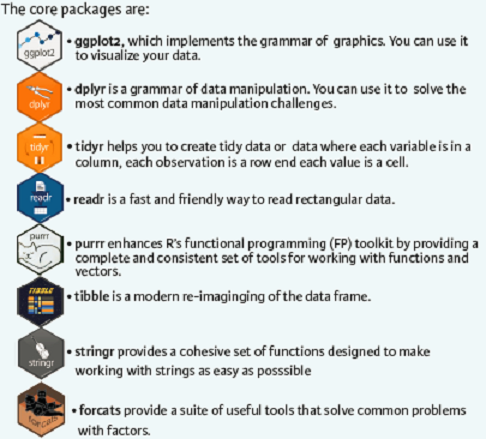
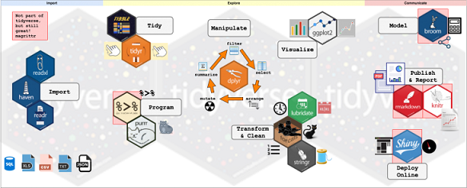
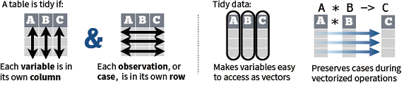
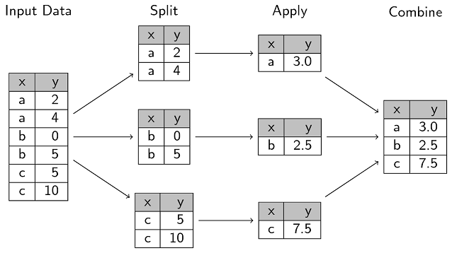
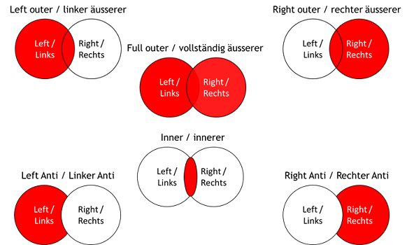

```{r setup, include=FALSE}
knitr::opts_chunk$set(echo = TRUE)
```
```{r}
suppressPackageStartupMessages(library(tidyverse))
```
## Overview of the tidyverse package  

Data manipulation is the core of data analysis. The **tidyverse** is an opinionated collection of R packages designed for data science. All packages share an underlying design philosophy, grammar, and data structures.

For a brief reference, see the [Cheat sheet](https://rstudio.com/wp-content/uploads/2015/02/data-wrangling-cheatsheet.pdf) and [tideverse](https://tidyverse.tidyverse.org/). For a comprehensive guide, read this book [R for Data Science] by Hadley Wickham. We will only briefly introduce some functions here and later.

Install and load the complete tidyverse:
```{}
install.packages("tidyverse")
library("tidyverse")
```

A list of core tidyverse packages are as follows:  
  
These packages form a pipeline of data analysis in R,  working from data importing, manipulation, modelling to communicating results.  

  

## Tidy data with tidyr
Tidy data is a way to organize tabular data. It provides a consistent data structure across packages.  
  
### Reshape data
#### transpose
```{r include = FALSE}
# example using built-in dataset
mtcars
t(mtcars)
```

#### Converting data between wide and long formats  
There are two sets of methods that are explained below:  
* melt() and dcast() from the **reshape2** package.  
* gather() and spread() from the **tidyr** package. This is a newer interface to the reshape2 package. we will focus on this one.

This example is from [R cookbook](http://www.cookbook-r.com/Manipulating_data/Converting_data_between_wide_and_long_format/).

```{r}
olddata_wide <- read.table(header = TRUE, text = '
 subject sex control cond1 cond2
       1   M     7.9  12.3  10.7
       2   F     6.3  10.6  11.1
       3   F     9.5  13.1  13.8
       4   M    11.5  13.4  12.9
')
# Make sure the subject column is a factor
olddata_wide$subject <- factor(olddata_wide$subject)
olddata_long <- read.table(header = TRUE, text = '
 subject sex condition measurement
       1   M   control         7.9
       1   M     cond1        12.3
       1   M     cond2        10.7
       2   F   control         6.3
       2   F     cond1        10.6
       2   F     cond2        11.1
       3   F   control         9.5
       3   F     cond1        13.1
       3   F     cond2        13.8
       4   M   control        11.5
       4   M     cond1        13.4
       4   M     cond2        12.9
')
# Make sure the subject column is a factor
olddata_long$subject <- factor(olddata_long$subject)

############ From wide to long format using gather() 
suppressMessages(library(tidyr))

# The arguments to gather():
# - data: Data object
# - key: Name of new key column (made from names of data columns)
# - value: Name of new value column
# - ...: Names of source columns that contain values
# - factor_key: Treat the new key column as a factor (instead of character vector)
data_long <- gather(olddata_wide, condition, 
                    measurement, control:cond2, factor_key = TRUE)

#In this example, the source columns that are gathered are specified with control:cond2. This means to use all the columns, positionally, between control and cond2. Another way of doing it is to name the columns individually, as in:

gather(olddata_wide, condition, measurement, control, cond1, cond2)

#If you need to use gather() programmatically, you may need to use variables containing column names. To do this, you should use the gather_() function instead, which takes strings instead of bare (unquoted) column names.

keycol <- "condition"
valuecol <- "measurement"
gathercols <- c("control", "cond1", "cond2")

gather_(olddata_wide, keycol, valuecol, gathercols)

######## From long to wide use spread():
olddata_long

# The arguments to spread():
# - data: Data object
# - key: Name of column containing the new column names
# - value: Name of column containing values
data_wide <- spread(olddata_long, condition, measurement)
data_wide
```
### Handling missing values  
1. drop_na(data, ...): Drop rows containing NA's in . columns.

2. fill(data, ..., .direction = c("down", "up")): Fill in NA's in . columns with most recent non-NA values.

3. replace_na(data, replace = list(), ...): Replace NA's by column.
```{r}
x <- tibble(a = LETTERS[1:5], b = c(1, NA, NA, 3, NA))
drop_na(x, b)

fill(x, b)

replace_na(x, list(b = 2))
```
### Expand tables - quick create tables with combinations of values  
1. complete(data, ..., fill = list()): Adds to the data missing combinations of the values of the variables listed in . 

2. expand(data, ...) Create new tibble with all possible combinations of the values of the variables listed in . 
```{r eval = FALSE}
mtcars_complete <- complete(mtcars, cyl, gear, carb)

mtcars_expanded <- expand(mtcars, cyl, gear, carb)
```

### Split cells
Use these functions to split cells into individual, isolated values.
1. separate(): Separate each cell in a column to make several columns.
```{r eval = FALSE}
separate(data, col, into, sep = "[^[:alnum:]]+", remove = TRUE, convert = FALSE, extra = "warn", fill = "warn", ...)
```
2. separate_rows(): Separate each cell in a column to make several rows. Also separate_rows_().
```{r eval = FALSE}
separate_rows(data, ..., sep = "[^[:alnum:].]+", convert = FALSE) 
```
3. unite(): Collapse cells across several columns to make a single column.  
```{r eval = FALSE}
unite(data, col, ..., sep = "_", remove = TRUE) 
```
```{r}
tb <- tibble(country = rep(LETTERS[1:3], each = 2),
             year = rep(c(1999, 2000), 3),
             rate = c("0.7K/19M", "2K/20M", "37K/172M",
                      "80K/174M", "212K/1T", "213K/1T"))
# separate into wide format
tb_sep <- separate(tb, rate, into = c("case", "pop"), sep = "/")

# separate into long format
tb_sep_long <- separate_rows(tb, rate, sep = "/")

tb_back <- unite(tb_sep, case, pop, col = "rate", sep = "/") 
```

## Data transformation with dplyr  

In this section we mainly talk about the dplyr package for data transformation. See [the dplyr reference](https://dplyr.tidyverse.org/) and [its cheat sheet](https://github.com/rstudio/cheatsheets/blob/master/data-transformation.pdf).


```{r}
## Loading data
library("datasets")

attach(iris)
str(iris)
```

## Introduction to the dplyr package

### Manipulate cases
#### Extract cases: using row functions to return a subset of rows as a new table

1. _filter()_: extract rows meeting logical criteria. 
```{r}
?filter

# Select iris data of species "virginica"
iris %>% filter(Species == "virginica") 

# Select iris data of species and sepal length greater than 6
iris %>% filter(Species == "virginica", Sepal.Length > 6)
```
2. _distinct()_: remove rows with duplicate values.
```{r}
?distinct

distinct(iris, Species)
iris %>% distinct(Species, .keep_all = TRUE)
```

3. _sample_frac()_ and _sample_n()_: Randomly select fractions or a given number of rows
```{r}
sample_frac(iris, 0.5, replace = TRUE)
sample_n(iris, 10, replace = TRUE)
```
4. slice(): select rows by position; top_n(): select and order top n entries.
```{r}
slice(iris, 10:15)

top_n(iris, 5, Sepal.Width)
```
#### Arrange cases
1. _arrange()_: sorts rows by values of one or multiple columns
```{r}
?arrange

# Sort in ascending order of sepal length
iris %>% arrange(Sepal.Length)

# Sort in descending order of sepal length
iris %>% arrange(desc(Sepal.Length))

# combine multiple dplyr verbs in a row with the pipe operator
# Filter for species "virginica", then arrange in descending order of sepal length
iris %>% 
filter(Species=="virginica") %>% 
arrange(desc(Sepal.Length)) 
```
#### Add cases
1. _add_row()_:  add one or more rows to a table
```{r}
add_row(faithful, eruptions = 1, waiting = 1)
```


### Manipulate variables
#### Extract variables: Column functions return a set of columns as a new vector or table
1. pull(): Extract column values as a vector. Choose by names or index.
```{r}
pull(iris, Sepal.Length)
```
2. select(): Extract columns as a table. Use the helper functions with select():  

* starts_with(): Starts with a prefix.  
* ends_with(): Ends with a suffix.  
* contains(): Contains a literal string.
* matches(): Matches a regular expression.
* num_range(): Matches a numerical range like x01, x02, x03.
* one_of(): Matches variable names in a character vector.
* everything(): Matches all variables.
* last_col(): Select last variable, possibly with an offset.

For usage, see [select helper's documentation](https://www.rdocumentation.org/packages/dplyr/versions/0.7.2/topics/select_helpers).  

```{r}
iris <- tbl_df(iris) # so it prints a little nicer
select(iris, Sepal.Length, Species)
select(iris, starts_with("Petal"))
select(iris, ends_with("Width"))
select(iris, contains("etal"))
select(iris, matches(".t."))
select(iris, Petal.Length, Petal.Width)
select(iris, everything())
vars <- c("Petal.Length", "Petal.Width")
select(iris, one_of(vars))
```
#### Make new variables
These apply [vectorized functions](https://dplyr.tidyverse.org/reference/index.html) to columns. Vectorized funs take vectors as input and return vectors of the same length as output.  

1. _mutate()_: update or create new columns of a data frame
```{r}
# Change Sepal.Length to be in millimeters
iris %>% 
mutate(Sepal.Length = Sepal.Length*10) 

# Create a new column called SLMm
iris %>% 
mutate(SLMm = Sepal.Length*10) 

# create a piepline
iris %>%
filter(Species=="Virginica") %>%
mutate(SLMm=Sepal.Length*10) %>%
arrange(desc(SLMm))
```
2. transmute(): Computer new columns and drop others.
```{r}
transmute(mtcars, gpm = 1/mpg)
```
3. mutate_all() and mutate_if(): apply functions to every column or some columns meeting logical criteria.
```{r}
mutate_all(faithful, funs(log(.), log2(.)))
mutate_if(iris, is.numeric, funs(log(.)))
```
4. mutate_at(): Apply functions to specific columns.
```{r}
mutate_at(iris, vars(-Species), funs(log(.)))
```
5. add_column(): Add new column(s).
```{r}
add_column(mtcars, new = 1:32)
```
6. rename(): Rename columns.
```{r}
rename(iris, Length = Sepal.Length)
```
### Summarize cases
_summarize()_ or _summarise()_: Compute table of summaries for one column across all groups.
variants:  
* summarize_all(): Apply funs to every columns  
* secularize_at(): Apply funs to specific columns  
* summarize_if(): Apply funs to all cols of one type  
```{r}
# Summarize to find the median sepal length
iris %>% 
summarize(medianSL=median(Sepal.Length)) 

# Filter for virginica then summarize the median sepal length
iris %>% 
filter(Species=="virginica") %>% 
summarize(medianSL=median(Sepal.Length)) 

# Summarize multiple varibles at once
iris %>%
filter(Species=="virginica") %>%
summarize(medianSL=median(Sepal.Length),
          maxSL=max(Sepal.Length))

# Summarize within groups
# Find median and max sepal length of each species
iris %>% 
group_by(Species) %>% 
summarize(medianSL=median(Sepal.Length),
maxSL=max(Sepal.Length))

# Find median and max petal length of each species with sepal length > 6
iris %>% 
filter(Sepal.Length > 6) %>% 
group_by(Species) %>% 
summarize(medianPL=median(Petal.Length), 
maxPL=max(Petal.Length))
```
2. _count()_: Count  number of rows in each group defined by the variables in ...
```{r}
count(iris, Species)
```

### Group cases
Use group_by() to create a "grouped" copy of a table. dplyr functions will manipulate each "group" separately and then combine the results.  


ungroup() returns ungrouped copy of table.
```{r}
g_iris <- group_by(iris, Species)
ungroup(g_iris)
```

###  Combining tables- Join table horizontally
#### Combine variables

1. bind_cols(): returns tables placed side by side as a single table. It works like cbind().

**Attention**: To make sense, be sure that rows align.

2. use "mutating join" to join one table to columns from another, matching values with the rows that they correspond to.  
  

* left_join(x, y, by = NULL, copy=FALSE, suffix=c(".x",".y"),.) Join matching values from y to x.  
* right_join(x, y, by = NULL, copy = FALSE, suffix=c(".x",".y"),.) Join matching values from x to y.  
* inner_join(x, y, by = NULL, copy = FALSE, suffix=c(".x",".y"),.) Join data. Retain only rows with matches.  
* full_join(x, y, by = NULL, copy=FALSE, suffix=c(".x",".y"),.) Join data. Retain all values, all rows. 

3. Use a "Filtering Join" to filter one table against the rows of another.  

* semi_join(x, y, by = NULL, .) Return rows of x that have a match in y. USEFUL TO SEE WHAT WILL BE JOINED. 
* anti_join(x, y, by = NULL, .) Return rows of x that do not have a match in y. USEFUL TO SEE WHAT WILL NOT BE JOINED.


How to set the argument _by_:  

* Use by = c("col1", "col2", .) to specify one or more common columns to match on. left_join(x, y, by = "A")

* Use a named vector, by = c("col1" = "col2"), to match on columns that have different names in each table. left_join(x, y, by = c("C" = "D"))

* Use suffix to specify the suffix to give to unmatched columns that have the same name in both tables. left_join(x, y, by = c("C" = "D"), suffix = c("1", "2"))  

Taking the band membership dataset for example to demonstrate different ways of joining. These datasets (band_instruments, band_instruments2, and band_members) describe band members of the Beatles and Rolling Stones. They are toy data sets that can be displayed in their entirety on a slide (e.g. to demonstrate a join).  


```{r}
# To load the data,
library(dplyr)
data(package = "dplyr")

# take a look at the data
View(band_instruments)
View(band_instruments2)
View(band_members)

# "Mutating" joins combine variables from the LHS and RHS
band_members %>% inner_join(band_instruments)

band_members %>% left_join(band_instruments)

band_members %>% right_join(band_instruments)

band_members %>% full_join(band_instruments)

# "Filtering" joins keep cases from the LHS
band_members %>% semi_join(band_instruments)

band_members %>% anti_join(band_instruments)

# "Nesting" joins keep cases from the LHS and nests the RHS
band_members %>% nest_join(band_instruments)

# To suppress the message, supply by
band_members %>% inner_join(band_instruments, by = "name")

# Use a named `by` if the join variables have different names
band_members %>% full_join(band_instruments2, by = c("name" = "artist"))
```

### Combine cases-merge tables vertically
1. bind_rows(): Returns tables one on top of the other as a single table. Set .id to a column name to add a column of the original table names (as pictured). It works like _rbind()_.  
2. intersect(x, y, ...): Rows that appear in both x and y.  
3. setdiff(x, y, ...): Rows that appear in x but not y.  
4. union(x, y, ...): Rows that appear in x or y. (Duplicates removed). union_all() retains duplicates.  


## Type conversion between data structures

Use _is.foo_ to test for data type foo. Returns TRUE or FALSE
Use _as.foo_ to explicitly convert it.

is.numeric(), is.logical(), is.character(), is.vector(), is.atomic(), is.list(), is.factor(), is.matrix(), is.data.frame()

as.numeric(), as.logical(), as.character(), as.vector(), as.list(), as.factor(), as.matrix(), as.data.frame)

**Attention**: When is the is.vector() test valid?
Remember how to convert factor to numeric vector sensibly?

||to one long vector|to matrix|to data frame|to tibble|
|-|-----------------|---------|-------------|---------|
|from vector|c(x,y)|cbind(x,y); rbind(x,y)|data.frame(x,y)|tibble(x, y)|
|from matrix|as.vector(mymatrix)||as.data.frame(mymatrix)|as_tibble(mymatrix)|
|from data frame||as.matrix(myframe)||as_tibble(myframe)|
|from tibble|||as.data.frame(mytibble)||


## String manipulation with **stringr**


## Manipulation on other types of data 
Use the **forcats** package to manipulate [factor vectors](https://forcats.tidyverse.org/); use the **lubridate** package to manipulate [date and time data](https://lubridate.tidyverse.org/).

## Advanced topic
Apply functions with purr on [lists](https://purrr.tidyverse.org/).  

## Exercise

Here we will use the chick weight data to practice data manipulation uisng dplyr.  

The chicks were fed with four different diets from days 0 to 42 and body weights were measure every other 4 days. The data is available from a GitHub site: https://raw.githubusercontent.com/selva86/datasets/master/ChickWeight.csv

Task 1. Import the .csv data using read_csv() into a tibble.  
Task 2. Rename Diet and weight to arm and weight_g, respectively.  
Task 3. Select only rows where weight_g > 40 and arm == 1.  
Task 4. Add new column of weight_g in kilograms and time_week as time in weeks.  
Task 5. Sort rows by arm and then weight_g in an ascending order.  
Task 6. Recode arms from values 1, 2, 3, and to "vegetable", "fruit", "candy" and "meat", respectively.  
Task 7. Group chicks by "arm", then get summary for mean weight, max weight, mean time, number of cases. Finally, sort the output by mean weight.  
Task 8. Change column name from Time to weeks, then select only chicks with weight greater than 10, then group them by Time and arm, and get summary statistics: median weight_g, standard deviation of weight_g, and number of chicks per group.  


```{r}
# -----------------------------------------------
# Examples of using dplyr on the ChickWeight data
# ------------------------------------------------

library(tidyverse)         # Load tidyverse

chick <- as_tibble(ChickWeight)   # Save a copy of the ChickWeight data as chick

# Change some column names with rename()

chick <- chick %>%
  rename(arm = Diet,         # New = arm, old = Diet
         weight_g = weight)  # new = weight_g, old = weight

# Select rows with filter()

chick %>% 
  filter(weight_g > 40 & arm == 1)   # Only rows where weight_g > 40 and arm == 1

# Add columns with mutate()

chick <- chick %>%
  mutate(
    weight_g_kg = weight_g / 1000,  # Add new column of weight_g in kilograms
    time_week = Time / 7        # Add time_week as time in weeks
  )

# Sort rows with arrange()

chick <- chick %>%
  arrange(arm, weight_g)   # sort rows by arm and then weight_g

# Recode variables with case_when()

chick <- chick %>%
  mutate(
    arm_name = case_when(      # Rename arms with strings
      arm == 1 ~ "vegetables",
      arm == 2 ~ "fruit",
      arm == 3 ~ "candy",
      arm == 4 ~ "meat"
      
    )
  )

# Grouped statistics with group_by() and summarise()

chick %>%                             # Start with chick data...
  group_by(arm) %>%                   # Group by arm...
  summarise(                          # Summarise the following
    weight_g_mean = mean(weight_g),   # Mean weight
    weight_g_max = max(weight_g),     # Max weight
    time_mean = mean(Time),           # Mean time
    N = n()) %>%                      # Number of cases...
  arrange(weight_g_mean)              # Sort by mean weight


# Many sequential functions

chick %>%
  rename(weeks = Time) %>%            # Change column name
  filter(Chick > 10) %>%              # Only chicks with values larger than 10
  group_by(week, arm) %>%             # Group by Time and arm
  summarise(                          # Calculate summary statistics
    weight_g_median = median(weight_g),
    weight_g_sd = sd(weight_g),
    N = n()                           # Counts of cases
  )
```
