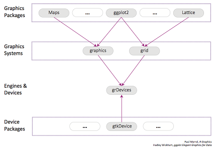
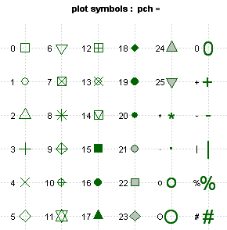
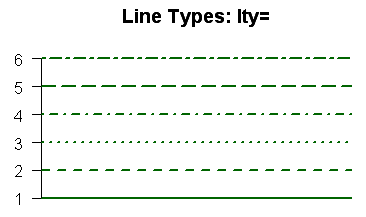
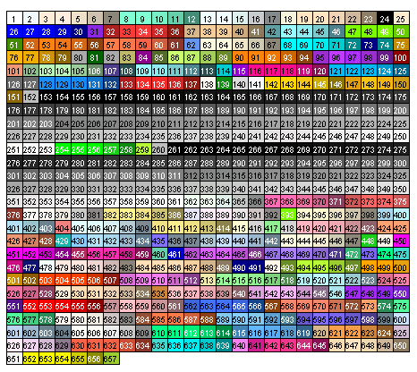
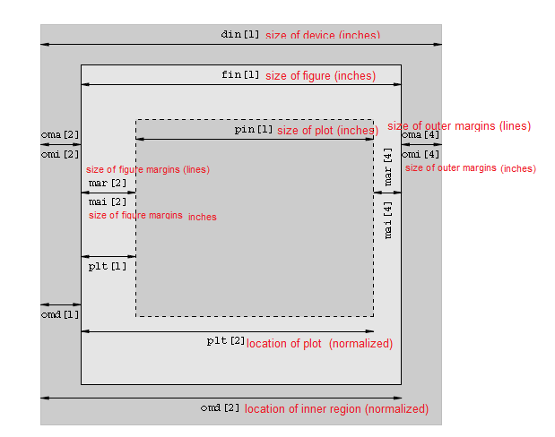

## Overview of R graphics systems
R has two graphics systems implemented in the R base package **graphics** and the **grid** package. See [An Introduction to R Graphics] (https://www.stat.auckland.ac.nz/~paul/RGraphics/chapter1.pdf). **ggplot2** is the most popular package for data visualization.  

  


## A quick view of data visualization  
### Creating a Graph
In R, graphs are typically created interactively.
```{r}
# Creating a Graph
suppressMessages(attach(mtcars))
plot(wt, mpg)
abline(lm(mpg~wt))
title("Regression of MPG on Weight")
```

The plot( ) function opens a graph window and plots weight vs. miles per gallon.
The next line of code adds a regression line to this graph. The final line adds a title.

### Saving Graphs
You can also save the graph via code using one of the following functions.  

|Function|Output to|
|--------|---------|
|pdf("mygraph.pdf")|pdf file|
|png("mygraph.png")|png file|
|jpeg("mygraph.jpg")|jpeg file|
|bmp("mygraph.bmp")|bmp file|

### Viewing Several Graphs
Creating a new graph by issuing a high level plotting command (plot, hist, boxplot, etc.) will typically overwrite a previous graph. To avoid this, open a new graph window before creating a new graph. To open a new graph window use one of the functions below. Rstudio can keep multiple graphs in the **"Plots"** tab.

|Function|Platform|
|--------|--------|
|windows()|Windows|
|X11()|Unix|
|quartz()|Mac|

You can have multiple graph windows open at one time. See help(dev.cur) for more details.

### Graphical Parameters
You can specify fonts, colors, line styles, axes, reference lines, etc, by specifying graphical parameters. This allows a wide degree of customization.


## Base Graphics System
### Histograms and Density Plots
1. Histograms  
You can create histograms with the function hist(x) where x is a numeric vector of values to be plotted. The option freq = FALSE plots probability densities instead of frequencies. The option breaks =  controls the number of bins.

```{r}
#Simple Histogram
hist(mtcars$mpg)

# Colored Histogram with Different Number of Bins
hist(mtcars$mpg, breaks = 12, col = "red")

# Add a Normal Curve
x <- mtcars$mpg
h <- hist(
  x,
  breaks = 10,
  col = "red",
  xlab = "Miles Per Gallon",
  main = "Histogram with Normal Curve"
)
xfit <- seq(min(x), max(x), length = 40)

# density
yfit <- dnorm(xfit, mean = mean(x), sd = sd(x))

# Frequency
yfit <- yfit * diff(h$mids[1:2]) * length(x)
lines(xfit, yfit, col = "blue", lwd = 2)
```

Histograms can be a poor method for determining the shape of a distribution because it is so strongly affected by the number of bins used.

2. Kernel Density Plots  
Kernel density plots are usually a much more effective way to view the distribution of a variable. Create the plot using plot(density(x)) where x is a numeric vector.
```{r}
# Kernel Density Plot
d <- density(mtcars$mpg) # returns the density data
plot(d) # plots the results

# Filled Density Plot
d <- density(mtcars$mpg)
plot(d, main = "Kernel Density of Miles Per Gallon")
polygon(d, col = "red", border = "blue")
```

3. Comparing Groups Via Kernel Density  
The sm.density.compare( ) function in the sm package allows you to superimpose the kernel density plots of two or more groups. The format is sm.density.compare(x, factor) where x is a numeric vector and factor is the grouping variable.
```{r}
# Compare MPG distributions for cars with
# 4,6, or 8 cylinders
library(sm)
# create value labels
cyl.f <- factor(cyl, levels = c(4,6,8),
  labels = c("4 cylinder", "6 cylinder", "8 cylinder"))

# plot densities
sm.density.compare(mpg, cyl, xlab = "Miles Per Gallon")
title(main = "MPG Distribution by Car Cylinders")

# add legend 
colfill <- c(2:(2 + length(levels(cyl.f))))
 legend("topright", levels(cyl.f), fill = colfill)
```

### Dot Plots  
Create dotplots with the dotchart(x, labels = ) function, where x is a numeric vector and labels is a vector of labels for each point. You can add a groups =  option to designate a factor specifying how the elements of x are grouped. If so, the option gcolor =  controls the color of the groups label. cex controls the size of the labels.

```{r}
# Dotplot: Grouped Sorted and Colored
# Sort by mpg, group and color by cylinder
x <- mtcars[order(mtcars$mpg),] # sort by mpg
x$cyl <- factor(x$cyl) # it must be a factor
x$color[x$cyl == 4] <- "red"
x$color[x$cyl == 6] <- "blue"
x$color[x$cyl == 8] <- "darkgreen"
dotchart(x$mpg,labels = row.names(x),cex = .7,groups =  x$cyl,
   main = "Gas Mileage for Car Models\ngrouped by cylinder",
   xlab = "Miles Per Gallon", gcolor = "black", color = x$color)
```

Advanced dotplots can be created with the dotplot2( ) function in the Hmisc package and with the panel.dotplot( ) function in the lattice package.

### Bar Plots
Create barplots with the barplot(height) function, where height is a vector or matrix. If height is a vector, the values determine the heights of the bars in the plot. If height is a matrix and the option beside = FALSE then each bar of the plot corresponds to a column of height, with the values in the column giving the heights of stacked sub-bars. If height is a matrix and beside = TRUE, then the values in each column are juxtaposed rather than stacked. Include option names.arg = (character vector) to label the bars. The option horiz = TRUE to create a horizontal barplot.


1. Simple bar plot
```{r}
# Simple Bar Plot
counts <- table(mtcars$gear)
barplot(counts, main = "Car Distribution",
   xlab = "Number of Gears")

# Simple Horizontal Bar Plot with Added Labels
counts <- table(mtcars$gear)
barplot(counts, main = "Car Distribution", horiz = TRUE,
  names.arg = c("3 Gears", "4 Gears", "5 Gears"))
```

2. Stacked Bar Plot
```{r}
# Stacked Bar Plot with Colors and Legend
counts <- table(mtcars$vs, mtcars$gear)
barplot(counts, main = "Car Distribution by Gears and VS",
  xlab = "Number of Gears", col = c("darkblue","red"),
  legend = rownames(counts))
```

3. Grouped Bar Plot
```{r}
# Grouped Bar Plot
counts <- table(mtcars$vs, mtcars$gear)
barplot(counts, main = "Car Distribution by Gears and VS",
  xlab = "Number of Gears", col = c("darkblue","red"),
  legend = rownames(counts), beside = TRUE)
```  


### Line charts
The lines( ) function adds information to a graph. It can not produce a graph on its own. Usually it follows a plot(x, y) command that produces a graph.  

By default, plot( ) plots the (x,y) points. Use the type = "n" option in the plot( ) command, to create the graph with axes, titles, etc., but without plotting the points.

Line charts are created with the function lines(x, y, type = ) where x and y are numeric vectors of (x,y) points to connect. type = can take the following values:  

|Type|Description|
|----|-----------|
|p|points|
|l|lines|
|o|overplotted points and lines|
|b, c|points (empty if "c") joined by lines|
|s, S|stair steps|
|h|histogram-like vertical lines|
|n|does not produce any points or lines|

Next, we demonstrate each of the type = options when plot( ) sets up the graph and does plot the points.
```{r}
x <- c(1:5); y <- x # create some data
par(pch = 22, col = "blue") # plotting symbol and color
par(mfrow = c(2,4)) # all plots on one page
opts =  c("p","l","o","b","c","s","S","h")
for (i in 1:length(opts)){
  heading =  paste("type = ",opts[i])
  plot(x, y, main = heading)
  lines(x, y, type = opts[i])
}
```

```{r}
# Create Line Chart
# convert factor to numeric for convenience
Orange$Tree <- as.numeric(Orange$Tree)
ntrees <- max(Orange$Tree)

# get the range for the x and y axis
xrange <- range(Orange$age)
yrange <- range(Orange$circumference)

# set up the plot
plot(xrange, yrange, type = "n", xlab = "Age (days)",
   ylab = "Circumference (mm)" )
colors <- rainbow(ntrees)
linetype <- c(1:ntrees)
plotchar <- seq(18,18+ntrees,1)

# add lines
for (i in 1:ntrees) {
  tree <- subset(Orange, Tree == i)
  lines(tree$age, tree$circumference, type = "b", lwd = 1.5,
    lty = linetype[i], col = colors[i], pch = plotchar[i])
}

# add a title and subtitle
title("Tree Growth", "example of line plot")

# add a legend
legend(xrange[1], yrange[2], 1:ntrees, cex = 0.8, col = colors,
   pch = plotchar, lty = linetype, title = "Tree")
```

### Boxplots
Boxplots can be created for individual variables or for variables by group. The format is boxplot(x, data = ), where x is a formula and data =  denotes the data frame providing the data. An example of a formula is y~group where a separate boxplot for numeric variable y is generated for each value of group. Add varwidth = TRUE to make boxplot widths proportional to the square root of the samples sizes. Add horizontal = TRUE to reverse the axis orientation.

```{r}
# Boxplot of MPG by Car Cylinders
boxplot(mpg~cyl,data = mtcars, main = "Car Mileage Data",
   xlab = "Number of Cylinders", ylab = "Miles Per Gallon")

# Notched Boxplot of Tooth Growth Against 2 Crossed Factors
# boxes colored for ease of interpretation
boxplot(len~supp*dose, data =  ToothGrowth, notch = TRUE,
  col = (c("gold","darkgreen")),
  main = "Tooth Growth", xlab = "Supplement and Dose")
```
In the notched boxplot, if two boxes' notches do not overlap this is strong evidence their medians differ (Chambers et al., 1983, p. 62).

Other Options
The boxplot.matrix( ) function in the sfsmisc package draws a boxplot for each column (row) in a matrix. The boxplot.n( ) function in the gplots package annotates each boxplot with its sample size. The bplot( ) function in the Rlab package offers many more options controlling the positioning and labeling of boxes in the output.

Violin Plots
A violin plot is a combination of a boxplot and a kernel density plot. They can be created using the vioplot( ) function from vioplot package.
```{r}
# Violin Plots
if (!require("vioplot")) {install.packages("vioplot")}
library(vioplot)
x1 <- mtcars$mpg[mtcars$cyl == 4]
x2 <- mtcars$mpg[mtcars$cyl == 6]
x3 <- mtcars$mpg[mtcars$cyl == 8]
vioplot(x1, x2, x3, names = c("4 cyl", "6 cyl", "8 cyl"),
   col = "gold")
title("Violin Plots of Miles Per Gallon")
```

Bagplot - A 2D Boxplot Extension
The bagplot(x, y) function in the aplpack package provides a bivariate version of the univariate boxplot. The bag contains 50% of all points. The bivariate median is approximated. The fence separates points in the fence from points outside. Outliers are displayed.

```{r}
# Example of a Bagplot
if (!require("aplpack")) {install.packages("aplpack")}
library(aplpack)
bagplot(wt,mpg, xlab = "Car Weight", 
        ylab = "Miles Per Gallon",
        main = "Bagplot Example")
```

### Scatterplots
1. Simple Scatterplot  
There are many ways to create a scatterplot in R. The basic function is plot(x, y), where x and y are numeric vectors denoting the (x,y) points to plot.
```{r}
# Simple Scatterplot
plot(wt, mpg, main = "Scatterplot Example",
   xlab = "Car Weight ", ylab = "Miles Per Gallon ", pch = 19)

# Add fit lines
abline(lm(mpg~wt), col = "red") # regression line (y~x)
lines(lowess(wt,mpg), col = "blue") # lowess line (x,y)
```

The _scatterplot( )_ function in the **car** package offers many enhanced features, including fit lines, marginal box plots, conditioning on a factor, and interactive point identification. Each of these features is optional.
```{r}
# Enhanced Scatterplot of MPG vs. Weight
# by Number of Car Cylinders
library(car)
scatterplot(mpg ~ wt, data = mtcars,
   xlab = "Weight of Car", ylab = "Miles Per Gallon",
   main = "Enhanced Scatter Plot")
```

2. Scatterplot Matrices  
There are at least 4 useful functions for creating scatterplot matrices. Analysts must love scatterplot matrices!

```{r}
# Basic Scatterplot Matrix
pairs(~mpg+disp+drat+wt,data = mtcars,
   main = "Simple Scatterplot Matrix")

# The lattice package provides options to condition the scatterplot matrix on a factor.

# Scatterplot Matrices from the lattice Package
library(lattice)
super.sym <- trellis.par.get("superpose.symbol")
splom(mtcars[c(1,3,5,6)], groups = cyl,
   panel = panel.superpose,
   key = list(title = "Three Cylinder Options",
   columns = 3,
   points = list(pch = super.sym$pch[1:3],
   col = super.sym$col[1:3]),
   text = list(c("4 Cylinder","6 Cylinder","8 Cylinder"))))

# The car package can condition the scatterplot.matrix on a factor, and optionally include lowess and linear best fit lines, and boxplot, densities, or histograms in the principal diagonal, as well as rug plots in the margins of the cells.

# Scatterplot Matrices from the car Package
library(car)
scatterplotMatrix(~mpg + disp + drat + wt|cyl, 
                   data = mtcars,
                   main = "Three Cylinder Options")

# The gclus package provides options to rearrange the variables so that those with higher correlations are closer to the principal diagonal. It can also color code the cells to reflect the size of the correlations.

# Scatterplot Matrices from the glus Package
library(gclus)
dta <- mtcars[c(1,3,5,6)] # get data
dta.r <- abs(cor(dta)) # get correlations
dta.col <- dmat.color(dta.r) # get colors
# reorder variables so those with highest correlation
# are closest to the diagonal
dta.o <- order.single(dta.r)
cpairs(dta, dta.o, panel.colors = dta.col, gap = .5,
main = "Variables Ordered and Colored by Correlation" )
```

3. High Density Scatterplots  
When there are many data points and significant overlap, scatterplots become less useful. There are several approaches that be used when this occurs. The hexbin(x, y) function in the hexbin package provides bivariate binning into hexagonal cells (it looks better than it sounds).
```{r}
# High Density Scatterplot with Binning
library(hexbin)
x <- rnorm(1000)
y <- rnorm(1000)
bin <- hexbin(x, y, xbins = 50)
plot(bin, main = "Hexagonal Binning")
```
Alternatively, _smoothScatter()_ produces a smoothed color density representation of a scatterplot, obtained through a (2D) kernel density estimate.
```{r}
n <- 10000
x1  <- matrix(rnorm(n), ncol = 2)
x2  <- matrix(rnorm(n, mean = 3, sd = 1.5), ncol = 2)
x   <- rbind(x1, x2)

oldpar <- par(mfrow = c(2, 2), mar=.1+c(3,3,1,1), mgp = c(1.5, 0.5, 0))
smoothScatter(x, nrpoints = 0)
smoothScatter(x)

## a different color scheme:
Lab.palette <- colorRampPalette(c("blue", "orange", "red"), space = "Lab")
i.s <- smoothScatter(x, colramp = Lab.palette,
                     ## pch=NA: do not draw them
                     nrpoints = 250, ret.selection=TRUE)
## label the 20 very lowest-density points,the "outliers" (with obs.number):
i.20 <- i.s[1:20]
text(x[i.20,], labels = i.20, cex = 0.75)
```

Another option for a scatterplot with significant point overlap is the sunflowerplot. See help(sunflowerplot) for details.

Finally, you can save the scatterplot in PDF format and use color transparency to allow points that overlap to show through (this idea comes from B.S. Everrit in HSAUR).

```{r}
# High Density Scatterplot with Color Transparency
pdf("scatterplot.pdf")
x <- rnorm(1000)
y <- rnorm(1000)
plot(x,y, main = "PDF Scatterplot Example", 
     col = rgb(0,100,0,50, maxColorValue = 255),
     pch = 16)
dev.off()
```

Note: You can use the col2rgb( ) function to get the rbg values for R colors. For example, col2rgb("darkgreen") yields r = 0, g = 100, b = 0. Then add the alpha transparency level as the 4th number in the color vector. A value of zero means fully transparent. See help(rgb) for more information.

4. 3D Scatterplots  
You can create a 3D scatterplot with the scatterplot3d package. Use the function scatterplot3d(x, y, z).
```{r}
# 3D Scatterplot
library(scatterplot3d)

scatterplot3d(wt,disp,mpg, main = "3D Scatterplot")

# 3D Scatterplot with Coloring and Vertical Drop Lines
library(scatterplot3d)

scatterplot3d(wt,disp,mpg, pch = 16, highlight.3d = TRUE,
  type = "h", main = "3D Scatterplot")

# 3D Scatterplot with Coloring and Vertical Lines
# and Regression Plane
library(scatterplot3d)

s3d <- scatterplot3d(wt,disp,mpg, pch = 16, highlight.3d = TRUE,
  type = "h", main = "3D Scatterplot")
fit <- lm(mpg ~ wt+disp)
s3d$plane3d(fit)
```

5. Spinning 3D Scatterplots
You can also create an interactive 3D scatterplot using the plot3D(x, y, z) function in the rgl package. It creates a spinning 3D scatterplot that can be rotated with the mouse. The first three arguments are the x, y, and z numeric vectors representing points. col =  and size =  control the color and size of the points respectively.
```{r}
# Spinning 3d Scatterplot
library(rgl)
plot3d(wt, disp, mpg, col = "red", size = 3)

# You can perform a similar function with the scatter3d(x, y, z) in the Rcmdr package.
# Another Spinning 3d Scatterplot
if (!require("Rcmdr")) {install.packages("Rcmdr")}
library(Rcmdr)

scatter3d(wt, disp, mpg)
```

## Graphical Parameters
You can customize many features of your graphs (fonts, colors, axes, titles) through graphic options. See a .  

One way is to specify these options in through the par( ) function. If you set parameter values here, the changes will be in effect for the rest of the session or until you change them again. The format is par(optionname=value, optionname=value, ...). 

```{r}
# Set a graphical parameter using par()
# par()              # view current settings
suppressWarnings({
  opar <- par()     # make a copy of current settings
  par(col.lab = "red") # red x and y labels
  hist(mtcars$mpg)   # create a plot with these new settings
  par(opar)
})         # restore original settings
```

A second way to specify graphical parameters is by providing the optionname=value pairs directly to a high level plotting function. In this case, the options are only in effect for that specific graph.

```{r}
# Set a graphical parameter within the plotting function
hist(mtcars$mpg, col.lab = "red")
```

See the help for a specific high level plotting function (e.g. plot, hist, boxplot) to determine which graphical parameters can be set this way.

The remainder of this section describes some of the more important graphical parameters that you can set.

### Text and Symbol Size  
The following options can be used to control text and symbol size in graphs.

|Option|Description|
|------|-----------|
|cex|number indicating the amount by which plotting text and symbols should be scaled relative to the default. 1=default, 1.5 is 50% larger, 0.5 is 50% smaller, etc.|
|cex.axis|magnification of axis annotation relative to cex|
|cex.lab|magnification of x and y labels relative to cex|
|cex.main|magnification of titles relative to cex|
|cex.sub|magnification of subtitles relative to cex|

### Plotting Symbols  
Use the pch= option to specify symbols to use when plotting points. For symbols 21 through 25, specify border color (col=) and fill color (bg=).  
  

### Lines
You can change lines using the following options. This is particularly useful for reference lines, axes, and fit lines.

|Option|Description|
|------|-----------|
|lty|line type. see the chart below.|
|lwd|line width relative to the default (default=1). 2 is twice as wide.|

  

### Colors
Options that specify colors include the following.

|Option|Description|
|------|-----------|
|col|Default plotting color. Some functions (e.g. lines) accept a vector of values that are recycled.|
|col.axis|color for axis annotation|
|col.lab|color for x and y labels|
|col.main|color for titles|
|col.sub|color for subtitles|
|fg|plot foreground color (axes, boxes - also sets col= to same)|
|bg|plot background color|

You can specify colors in R by index, name, hexadecimal, or RGB.
For example col=1, col="white", and col="#FFFFFF" are equivalent.

The following chart was produced with code developed by Earl F. Glynn. For more options, see this [cheat sheet](https://www.nceas.ucsb.edu/~frazier/RSpatialGuides/colorPaletteCheatsheet.pdf).  


  

You can also create a vector of n contiguous colors using the functions rainbow(n), heat.colors(n), terrain.colors(n), topo.colors(n), and cm.colors(n).

colors() returns all available color names.

### Fonts
You can easily set font size and style, but font family is a bit more complicated.

|Option|Description|
|------|-----------|
|font|Integer specifying font to use for text.
1=plain, 2=bold, 3=italic, 4=bold italic, 5=symbol|
|font.axis|font for axis annotation|
|font.lab|font for x and y labels|
|font.main|font for titles|
|font.sub|font for subtitles|
|ps|font point size (roughly 1/72 inch)|
|text size=ps*cex|
|family|font family for drawing text. Standard values are "serif", "sans", "mono", "symbol".|

Font mapping is device dependent.  
In windows, mono is mapped to "TT Courier New", serif is mapped to"TT Times New Roman", sans is mapped to "TT Arial", mono is mapped to "TT Courier New", and symbol is mapped to "TT Symbol" (TT=True Type). You can add your own mappings.
```{r}
# Type family examples - creating new mappings
plot(1:10, 1:10, type = "n")
windowsFonts(
  A = windowsFont("Arial Black"),
  B = windowsFont("Bookman Old Style"),
  C = windowsFont("Comic Sans MS"),
  D = windowsFont("Symbol")
)
text(3, 3, "Hello World Default")
text(4, 4, family = "A", "Hello World from Arial Black")
text(5, 5, family = "B", "Hello World from Bookman Old Style")
text(6, 6, family = "C", "Hello World from Comic Sans MS")
text(7, 7, family = "D", "Hello World from Symbol")
```

### Margins and Graph Size
You can control the margin size using the following parameters.

|Option|Description|
|------|-----------|
|mar|numerical vector indicating margin size c(bottom, left, top, right) in lines. default = c(5, 4, 4, 2) + 0.1|
|mai|numerical vector indicating margin size c(bottom, left, top, right) in inches|
|pin|plot dimensions (width, height) in inches|
For complete information on margins, See the diagram below:  
  

### Axes and Text  
Many high level plotting functions (plot, hist, boxplot, etc.) allow you to include axis and text options (as well as other graphical parameters). For example

```{r eval = FALSE}
# not run
# Specify axis options within plot()
plot(
  x,
  y,
  main = "title",
  sub = "subtitle",
  xlab = "X-axis label",
  ylab = "y-axix label",
  xlim = c(xmin, xmax),
  ylim = c(ymin, ymax)
)
```
For finer control or for modularization, you can use the functions described below.

#### Titles  
Use the title( ) function to add labels to a plot.
```{r eval = FALSE}
# not run
title(
  main = "main title",
  sub = "sub-title",
  xlab = "x-axis label",
  ylab = "y-axis label"
)
```
Many other graphical parameters (such as text size, font, rotation, and color) can also be specified in the title( ) function.

```{r eval = FALSE}
# not run
# Add a red title and a blue subtitle. Make x and y
# labels 25% smaller than the default and green.
title(
  main = "My Title",
  col.main = "red",
  sub = "My Sub-title",
  col.sub = "blue",
  xlab = "My X label",
  ylab = "My Y label",
  col.lab = "green",
  cex.lab = 0.75
)
```
#### Text Annotations  
Text can be added to graphs using the text( ) and mtext( ) functions. text( ) places text within the graph while mtext( ) places text in one of the four margins.
```{r eval = FALSE}
# not run
text(location, "text to place", pos, ...)
mtext("text to place", side, line = n, ...)
```
Common options are described below.

|option|description|
|------|-----------|
|location|location can be an x,y coordinate. Alternatively, the text can be placed interactively via mouse by specifying location as locator(1).|
|pos|position relative to location. 1=below, 2=left, 3=above, 4=right. If you specify pos, you can specify offset= in percent of character width.|
|side|which margin to place text. 1=bottom, 2=left, 3=top, 4=right. you can specify line= to indicate the line in the margin starting with 0 and moving out. you can also specify adj=0 for left/bottom alignment or adj=1 for top/right alignment.|

Other common options are cex, col, and font (for size, color, and font style respectively).

#### Labeling points  
You can use the text( ) function (see above) for labeling point as well as for adding other text annotations. Specify location as a set of x, y coordinates and specify the text to place as a vector of labels. The x, y, and label vectors should all be the same length.
```{r}
# Example of labeling points
plot(
  wt,
  mpg,
  main = "Mileage vs. Car Weight",
  xlab = "Weight",
  ylab = "Mileage",
  pch = 18,
  col = "blue"
)
text(
  wt,
  mpg,
  row.names(mtcars),
  cex = 0.6,
  pos = 4,
  col = "red"
)
```

#### Math Annotations
You can add mathematically formulas to a graph using TEX-like rules. See help(plotmath) for details and examples.

#### Axes  
You can create custom axes using the axis( ) function.
```{r eval = FALSE}
# not run
axis(side, at=, labels=, pos=, lty=, col=, las=, tck=, ...)
```
where

|Option|Description|
|------|-----------|
|side|an integer indicating the side of the graph to draw the axis (1=bottom, 2=left, 3=top, 4=right)|
|at|a numeric vector indicating where tic marks should be drawn|
|labels|a character vector of labels to be placed at the tickmarks
(if NULL, the at values will be used)|
|pos|the coordinate at which the axis line is to be drawn.
(i.e., the value on the other axis where it crosses)|
|lty|line type|
|col|the line and tick mark color|
|las|labels are parallel (=0) or perpendicular(=2) to axis|
|tck|length of tick mark as fraction of plotting region (negative number is outside graph, positive number is inside, 0 suppresses ticks, 1 creates gridlines) default is -0.01|
|...|other graphical parameters|

If you are going to create a custom axis, you should suppress the axis automatically generated by your high level plotting function. The option axes=FALSE suppresses both x and y axes. xaxt="n" and yaxt="n" suppress the x and y axis respectively. Here is a (somewhat overblown) example.

```{r}
# A Silly Axis Example

# specify the data
x <- c(1:10)
y <- x
z <- 10 / x

# create extra margin room on the right for an axis
par(mar = c(5, 4, 4, 8) + 0.1)

# plot x vs. y
plot(
  x,
  y,
  type = "b",
  pch = 21,
  col = "red",
  yaxt = "n",
  lty = 3,
  xlab = "",
  ylab = ""
)

# add x vs. 1/x
lines(
  x,
  z,
  type = "b",
  pch = 22,
  col = "blue",
  lty = 2
)

# draw an axis on the left
axis(
  2,
  at = x,
  labels = x,
  col.axis = "red",
  las = 2
)

# draw an axis on the right, with smaller text and ticks
axis(
  4,
  at = z,
  labels = round(z, digits = 2),
  col.axis = "blue",
  las = 2,
  cex.axis = 0.7,
  tck = -.01
)

# add a title for the right axis
mtext(
  "y=1/x",
  side = 4,
  line = 3,
  cex.lab = 1,
  las = 2,
  col = "blue"
)

# add a main title and bottom and left axis labels
title("An Example of Creative Axes", xlab = "X values",
      ylab = "Y=X")
```


#### Minor Tick Marks  
The minor.tick( ) function in the Hmisc package adds minor tick marks.
```{r eval = FALSE}
# not run 
# Add minor tick marks
library(Hmisc)
minor.tick(nx = n,
           ny = n,
           tick.ratio = n)
```
nx is the number of minor tick marks to place between x-axis major tick marks.
ny does the same for the y-axis. tick.ratio is the size of the minor tick mark relative to the major tick mark. The length of the major tick mark is retrieved from par("tck").

#### Reference Lines
Add reference lines to a graph using the abline( ) function.
```{r eval = FASLE}
# not run
abline(h = yvalues, v = xvalues)
```
Other graphical parameters (such as line type, color, and width) can also be specified in the abline( ) function.

```{r}
# add solid horizontal lines at y=1,5,7
plot(x = 1:10, y = 1:10, type = "p")
abline(h = c(1,5,7))
# add dashed blue verical lines at x = 1,3,5,7,9
abline(v = seq(1,10,2),lty = 2,col = "blue")
```

Note: You can also use the grid( ) function to add reference lines.

#### Legend  
Add a legend with the legend() function.
```{r eval = FALSE}
# not run 
legend(location, title, legend, ...)
```
Common options are described below.

|option|description|
|------|-----------|
|location|There are several ways to indicate the location of the legend. You can give an x,y coordinate for the upper left hand corner of the legend. You can use locator(1), in which case you use the mouse to indicate the location of the legend. You can also use the keywords "bottom", "bottomleft", "left", "topleft", "top", "topright", "right", "bottomright", or "center". If you use a keyword, you may want to use inset= to specify an amount to move the legend into the graph (as fraction of plot region).|
|title|A character string for the legend title (optional)|
|legend|A character vector with the labels|
|...|Other options. If the legend labels colored lines, specify col= and a vector of colors. If the legend labels point symbols, specify pch= and a vector of point symbols. If the legend labels line width or line style, use lwd= or lty= and a vector of widths or styles. To create colored boxes for the legend (common in bar, box, or pie charts), use fill= and a vector of colors.|

Other common legend options include bty for box type, bg for background color, cex for size, and text.col for text color. Setting horiz=TRUE sets the legend horizontally rather than vertically.
```{r}
# Legend Example
boxplot(
  mpg ~ cyl,
  main = "Mileage by Car Weight",
  yaxt = "n",
  xlab = "Mileage",
  horizontal = TRUE,
  col = terrain.colors(3)
)
legend(
  "topright",
  inset = .05,
  title = "Number of Cylinders",
  c("4", "6", "8"),
  fill = terrain.colors(3),
  horiz = TRUE
)
```
   

## Combining Plots
R makes it easy to combine multiple plots into one overall graph, using either the par( ) or layout( ) function.

With the par( ) function, you can include the option mfrow=c(nrows, ncols) to create a matrix of nrows x ncols plots that are filled in by row. mfcol=c(nrows, ncols) fills in the matrix by columns.
```{r}
# 4 figures arranged in 2 rows and 2 columns
par(mfrow = c(2, 2))
plot(wt, mpg, main = "Scatterplot of wt vs. mpg")
plot(wt, disp, main = "Scatterplot of wt vs disp")
hist(wt, main = "Histogram of wt")
boxplot(wt, main = "Boxplot of wt")
```

```{r}
# 3 figures arranged in 3 rows and 1 column
par(mfrow = c(3, 1))
hist(wt)
hist(mpg)
hist(disp)
```

The layout( ) function has the form layout(mat) where
mat is a matrix object specifying the location of the N figures to plot.
```{r}
# One figure in row 1 and two figures in row 2
layout(matrix(c(1,1,2,3), 2, 2, byrow = TRUE))
hist(wt)
hist(mpg)
hist(disp)
```

Optionally, you can include widths= and heights= options in the layout( ) function to control the size of each figure more precisely. These options have the form
widths: a vector of values for the widths of columns
heights:a vector of values for the heights of rows.

Relative widths are specified with numeric values. Absolute widths (in centimetres) are specified with the lcm() function.
```{r}
# One figure in row 1 and two figures in row 2
# row 1 is 1/3 the height of row 2
# column 2 is 1/4 the width of the column 1
layout(matrix(c(1, 1, 2, 3), 2, 2, byrow = TRUE),
       widths = c(3, 1),
       heights = c(1, 2))
hist(wt)
hist(mpg)
hist(disp)
```

See help(layout) for more details.  

Creating a figure arrangement with fine control  
In the following example, two box plots are added to scatterplot to create an enhanced graph.
```{r}
# Add boxplots to a scatterplot
par(fig = c(0, 0.8, 0, 0.8))
plot(mtcars$wt, mtcars$mpg, xlab = "Car Weight",
     ylab = "Miles Per Gallon")
par(fig = c(0, 0.8, 0.55, 1), new = TRUE)
boxplot(mtcars$wt, horizontal = TRUE, axes = FALSE)
par(fig = c(0.65, 1, 0, 0.8), new = TRUE)
boxplot(mtcars$mpg, axes = FALSE)
mtext(
  "Enhanced Scatterplot",
  side = 3,
  outer = TRUE,
  line = -3
)
```

