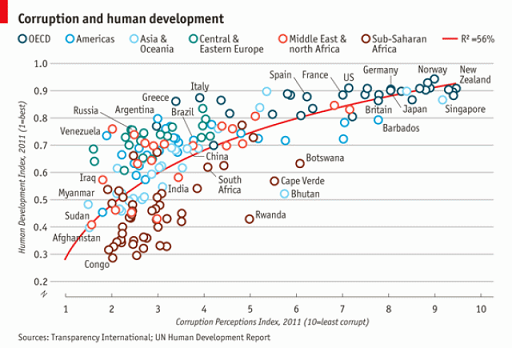

```{r include = FALSE}
knitr::opts_chunk$set(echo = TRUE, eval=TRUE, fig.width = 4, 
                      fig.height = 5, warning = FALSE, 
                      message = FALSE, encoding = "UTF-16")
```

```{r loadLibrariesNSetOpts, include = TRUE}
suppressPackageStartupMessages(
{
  library(ggplot2)
  library(grid)
  library(dplyr)
})

```                      
Graphics with ggplot2
The ggplot2 package, created by Hadley Wickham, offers a powerful graphics tool for creating elegant and complex plots. Its popularity in the R community has exploded in recent years. Originally based on Leland Wilkinson's _The Grammar of Graphics_, ggplot2 allows you to create graphs that represent **both univariate and multivariate numerical and categorical data** in a straightforward manner. Grouping can be represented by color, symbol, size, and transparency. 

Good references for learning and using ggplot2:  

* R Graphics Cookbook, by Winston Chang. Available at http://users.metu.edu.tr/ozancan/R%20Graphics%20Cookbook.pdf.

* ggplot2 reference site: https://ggplot2.tidyverse.org/reference/ and a [in-progress ggplot2 book, v3](https://ggplot2-book.org/).  

* The Grammar of Graphics (Statistics and Computing) 2nd Edition, by Leland Wilkinson.  
```{r, out.width='10%', fig.align='center', echo = FALSE}
knitr::include_graphics("Grammar of graphics.png")
```

A nice [ggplot2 cheatsheet](https://github.com/rstudio/cheatsheets/raw/master/data-visualization-2.1.pdf) is provided here.  


## Introduction to ggplot2  
All ggplot2 plots begin with a call to _ggplot()_, supplying **default data and aesthetic mappings**, specified by _aes()_. You then add layers, scales, coords and facets with **+**. To save a plot to disk, use ggsave().  

* ggplot(): Create a new ggplot template
* aes(): Construct aesthetic mappings
* `+`(gg)`%+%`: Add components to a plot
* ggsave(): Save a ggplot (or other grid object) with sensible defaults
* qplot() and quickplot(): Quick plot

### Layer: geoms
A layer combines **data, aesthetic mapping, a geom (geometric object), a stat (statistical transformation), and a position adjustment**. Typically, you will create layers using a _geom_XXX()_ function, **overriding** the default position and stat if needed.

### Layer: stats
A handful of layers are more easily specified with a _stat_XXX()_ function, drawing attention to the **statistical transformation** rather than the visual appearance. The computed variables can be mapped using stat().

### Layer: position adjustment
All layers have a **position adjustment that resolves overlapping geoms**. Override the default by using the position argument to the _geom_XXX()_ or _stat_XXX()_ function.

### Layer: annotations
Annotations are a special type of layer that **don't inherit global settings** from the plot. They are used to **add fixed reference data to plots**. Annotation can be added by the _geom_text()_ or _annotate()_ functions.  

### Scales
Scales control the details of **how data values are translated to visual properties**. Override the default scales to tweak details like the **axis labels or legend keys, or to use a completely different translation from data to aesthetic**. _labs()_ and _lims()_ are convenient helpers for the most common adjustments to the labels and limits.  

### Guides: axes and legends
The guides (the axes and legends) help readers interpret your plots. **Guides are mostly controlled via the scale (e.g. with the limits, breaks, and labels arguments), but sometimes you will need additional control over guide appearance**. Use guides() or the guide argument to individual scales along with guide_colourbar() or guide_legend().  

### Faceting
Faceting generates small multiples, each displaying a different subset of the data. Facets are an alternative to aesthetics for displaying additional discrete variables.  

### Faceting: labels
These functions provide a flexible toolkit for controlling the display of the **strip labels on facets**.  

### Coordinate systems
The coordinate system determines how the x and y aesthetics combine to position elements in the plot. The default coordinate system is Cartesian (coord_cartesian()), which can be tweaked with coord_map(), coord_fixed(), coord_flip(), and coord_trans(), or completely replaced with coord_polar().  

### Themes
Themes control the display of **all non-data elements** of the plot. You can override all settings with a complete theme like theme_bw(), or choose to tweak individual settings by using theme() and the _element_XXX()_ functions. Use theme_set() to modify the active theme, affecting all future plots.

## Learning ggplot2 basics by examples
This section is excerpted from [a blog by Rebecca Barter](http://www.rebeccabarter.com/blog/2017-11-17-ggplot2_tutorial/).  

First, we are going to make our first plot. This plot will be based on the gapminder dataset that can be found [here](https://raw.githubusercontent.com/swcarpentry/r-novice-gapminder/gh-pages/_episodes_rmd/data/gapminder-FiveYearData.csv). Below, we show the first 6 rows of the gapminder dataset.

```{r}
# to download the data directly:
gapminder <- read.csv("https://raw.githubusercontent.com/swcarpentry/r-novice-gapminder/gh-pages/_episodes_rmd/data/gapminder-FiveYearData.csv")
head(gapminder)
str(gapminder)
colnames(gapminder)
```
The first function we will use is _ggplot()_. This function allows us to define the data that we will be using to make the plot, as well as the aesthetic properties that will be mapped to the geometric objects. That is, we will tell ggplot **which data (a data frame) we are interested in and how each of the variables in our dataset will be used (e.g. as an x or y coordinate, as a coloring variable or a size variable, etc)**.

Below, we define our first ggplot object using the ggplot function, with the gapminder dataset and the x and y aesthetics defined by the gdpPercap and lifeExp variables, respectively.

The output of this function is a grid with gdpPercap as the x-axis and lifeExp as the y-axis. However, we have not yet told ggplot what type of geometric object the data will be mapped to, so no data has been displayed.

```{r}
# describe the base ggplot object and tell it what data we are interested in along with the aesthetic mapping
ggplot(data = gapminder, mapping = aes(x = gdpPercap, y = lifeExp))
```
### Aesthetic mapping to layers
Next, we will add a geom layer to our ggplot object. For example, we could add a points layer which would **automatically adopt the aesthetic mapping described in the previous line of code**.

```{r}
# describe the base ggplot object and tell it what data we are interested in along with the aesthetic mapping
ggplot(gapminder, aes(x = gdpPercap, y = lifeExp)) +
  # add a points layer on top
  geom_point()
```

What we have done is to map each country (row) in the data to a point in the space defined by the GDP and life expectancy value. The end result is an ugly blob of points. Fortunately, there are many things that we can do to make this blob of points prettier.

For example, we can change the **transparency** of all points by setting the **alpha** argument to a low value, changing the color of the points to be blue instead of black, and making the points smaller.

```{r}
ggplot(gapminder, aes(x = gdpPercap, y = lifeExp)) +
    # modify Transparency, color, and size
  geom_point(alpha = 0.5, col = "cornflowerblue", size = 0.5)
```

Note that the above argument changed the alpha value and color for all of the points at once.

One of the truly powerful features of ggplot2 is the ability to **change these aesthetics based on the data itself**. For example, perhaps we want to color each point by its continent. Instead of separating the data into five different subsets (based on the possible values of continent), and adding the different colored points separately, we can simply add all the points once and add an colour aesthetic map for continent.

**Note that whenever we are using a variable from the data to describe an aesthetic property of a geom, this aesthetic property needs to be included in the aes() function**. And categorical data should be factors.
```{r}
unique(gapminder$continent)

ggplot(gapminder, aes(x = gdpPercap, y = lifeExp, color = continent)) +
  geom_point(alpha = 0.5, size = 0.5)
```

We could also add aesthetic mappings for other features such as **shape, size, transparency (alpha)**, and more! For example, changing the size based on population:

```{r}
ggplot(gapminder, aes(x = gdpPercap, y = lifeExp, color = continent, size = pop)) +
  geom_point(alpha = 0.5)
```

### Types of layers
So far, we have only seen scatterplots (point geoms), however, there are many other geoms we could add, including:  

* lines  
* histograms  
* boxplots and violin plots  
* barplots  
* smoothed curves  

```{r}
# trends of life expectation over years for each country
ggplot(gapminder, aes(x = year, y = lifeExp, group = country, color = continent)) +
  geom_line(alpha = 0.5)

ggplot(gapminder, aes(x = continent, y = lifeExp, fill = continent)) +
  geom_boxplot()

ggplot(gapminder, aes(x = lifeExp)) + geom_histogram(binwidth = 3)

# GDP per capita against life expectancy for each country colored by continent and sized by population
ggplot(gapminder, aes(x = gdpPercap, y = lifeExp, size = pop)) +
  geom_point(aes(color = continent), alpha = 0.5) +
  geom_smooth(se = FALSE, method = "loess", color = "grey30")
```

### Scales
We are going to return to our original scatterplot example to discuss scales, legend and positioning.

To remind you, this scatterplot showed GDP per capita against life expectancy for each country colored by continent and sized by population.

To keep things simple, let's filter to a single year.

```{r}
gapminder_2007 <- gapminder %>% filter(year == 2007)
ggplot(gapminder_2007, aes(x = gdpPercap, y = lifeExp, color = continent, size = pop)) +
  geom_point(alpha = 0.5)
```

The scale of a plot describes the features of the space in which it is plotted. Arguably, it would be better to show gdpPercap on a logarithmic scale, rather than in its raw form. Fortunately, this is easy to do using a scale function, which can be considered another layer that transforms our plot.

```{r}
ggplot(gapminder_2007, aes(x = gdpPercap, y = lifeExp, color = continent, size = pop)) +
  geom_point(alpha = 0.5) +
  scale_x_log10()
```

The default x- (and y-) axes scales are scale_x_continuous and scale_y_continuous, but other options include scale_x_sqrt and scale_x_reverse.

Each of these scale functions has many options including changing the limits, the breaks, etc. For example in the plot below, we manipulate the x-axis by providing arguments to our scale function of choice.
```{r}
ggplot(gapminder_2007, aes(x = gdpPercap, y = lifeExp, color = continent, size = pop)) +
  geom_point(alpha = 0.5) +
  # clean the x-axis breaks
  scale_x_log10(breaks = c(1, 10, 100, 1000, 10000),
                limits = c(1, 120000))
```

Notice that we changed the name of the x-axis in the plot using the name argument "gdpPercap". This could also be done using the labs function. As an example, below we add a title and change the name of the y-axis and legends using the _labs()_ function.
```{r}
ggplot(gapminder_2007, aes(x = gdpPercap, y = lifeExp, color = continent, size = pop)) +
  # add scatter points
  geom_point(alpha = 0.5) +
  # log-scale the x-axis
  scale_x_log10() +
  # change labels
  labs(title = "GDP versus life expectancy in 2007",
       x = "GDP per capita (log scale)",
       y = "Life expectancy",
       size = "Population",
       color = "Continent")
```

We could also manipulate the scale of the size variable. Below, we expand the range of sizes and clean up the variable name. Since the variable we provided for size is a continuous variable (pop) we use the scale_size_continuous argument.

```{r}
ggplot(gapminder_2007, aes(x = gdpPercap, y = lifeExp, color = continent, size = pop)) +
  # add scatter points
  geom_point(alpha = 0.5) +
  # log-scale the x-axis
  scale_x_log10() +
  # change labels
  labs(title = "GDP versus life expectancy in 2007",
       x = "GDP per capita (log scale)",
       y = "Life expectancy",
       size = "Population (millions)",
       color = "Continent") +
  # change the size scale
  scale_size(range = c(0.1, 10),
             breaks = 1000000 * c(250, 500, 750, 1000, 1250),
             labels = c("250", "500", "750", "1000", "1250")) 
```

Scales also exist for other aesthetic features such as **fill, color, alpha, etc**.

### Faceting
Sometimes we want to make multiple plots of the same thing across different categories. This can be achieved with minimal repetition using faceting.

In the example below, we will remake the plot above individually for each continent.

```{r}
ggplot(gapminder_2007, aes(x = gdpPercap, y = lifeExp, color = continent, size = pop)) +
  # add scatter points
  geom_point(alpha = 0.5) +
  # log-scale the x-axis
  scale_x_log10() +
  # change labels
  labs(title = "GDP versus life expectancy in 2007",
       x = "GDP per capita (log scale)",
       y = "Life expectancy",
       size = "Population (millions)",
       color = "Continent") +
  # change the size scale
  scale_size(range = c(0.1, 10),
             breaks = 1000000 * c(250, 500, 750, 1000, 1250),
             labels = c("250", "500", "750", "1000", "1250")) +
  # add faceting
  facet_wrap(~continent)
```

### Themes: making even more beautiful figures with ggplot2
Some people actually don't like the grey background, nor do they like having a grid unless it really helps with the plot interpretation.

One of the simplest themes is **theme_classic**, however there are several other themes to choose from. **The ggthemes package offers many additional themes, but you could also make your own using the theme() function**. For more fonts, see [R Cookbook](http://www.cookbook-r.com/Graphs/Fonts/).  

```{r}
ggplot(gapminder_2007, aes(x = gdpPercap, y = lifeExp, color = continent, size = pop)) +
  # add scatter points
  geom_point(alpha = 0.5) +
  # clean the axes names and breaks
  scale_x_log10(breaks = c(1000, 10000),
                limits = c(200, 120000)) +
  # change labels
  labs(title = "GDP versus life expectancy in 2007",
       x = "GDP per capita (log scale)",
       y = "Life expectancy",
       size = "Population (millions)",
       color = "Continent") +
  # change the size scale
  scale_size(range = c(0.1, 10),
             breaks = 1000000 * c(250, 500, 750, 1000, 1250),
             labels = c("250", "500", "750", "1000", "1250")) +
  # add a nicer theme
  theme_classic(base_family = "sans")
```

As an example of further customization of the ggplot theme, below we do the following:  

* add some text annotations (add geom_text layer)  
* removing the population legend (set guide = "none" in scale_size())
* move the legend to the top (set legend.position = "top" in theme())  
* change the color of the axes lines and ticks (set axis.line = element_line(color = "grey85") and axis.ticks = element_line(color = "grey85") in theme())  
* move the title to the center (plot.title = element_text(hjust = 0.5))

```{r}
ggplot(gapminder_2007) +
  # add scatter points
  geom_point(aes(x = gdpPercap, y = lifeExp, 
                 color = continent, size = pop),alpha = 0.5) +
  # add some text annotations for the very large countries
  geom_text(aes(x = gdpPercap, y = lifeExp + 3, 
                label = country), color = "grey50",
            data = filter(gapminder_2007, pop > 1000000000 |
                              country %in% c("Nigeria", "United States"))) +
  # clean the axes names and breaks
  scale_x_log10(limits = c(200, 60000)) +
  # change labels
  labs(title = "GDP versus life expectancy in 2007",
       x = "GDP per capita (log scale)",
       y = "Life expectancy",
       size = "Population",
       color = "Continent") +
  # change the size scale
  scale_size(range = c(0.1, 10),
             # remove size legend
             guide = "none") +
  # add a nicer theme
  theme_classic() +
  # place legend at top and grey axis lines
  theme(legend.position = "top",
        plot.title = element_text(hjust = 0.5),
        axis.line = element_line(color = "grey85"),
        axis.ticks = element_line(color = "grey85"))
```

### Saving your plots
Besides using the conventional graphic output functions, such as pdf() and png(), along with dev.off(), you can save your plots using the ggsave() function. ggsave() is a convenient function for saving a plot. **It defaults to saving the last plot that you displayed, using the size of the current graphics device**. It also **guesses** the type of graphics device from the **extension**. See its arguments below:  
```{r eval = FALSE}
ggsave(filename, plot = last_plot(), device = NULL, path = NULL,
  scale = 1, width = NA, height = NA, units = c("in", "cm", "mm"), dpi = 300, limitsize = TRUE, ...)
```

```{r}
p <- ggplot(gapminder_2007) +
  # add scatter points
  geom_point(aes(x = gdpPercap, y = lifeExp, color = continent, size = pop),
             alpha = 0.5) +
  # add some text annotations for the very large countries
  geom_text(aes(x = gdpPercap, y = lifeExp + 3, label = country),
            color = "grey50",
            data = filter(gapminder_2007, pop > 1000000000 | country %in% c("Nigeria", "United States"))) +
  # clean the axes names and breaks
  scale_x_log10(limits = c(200, 60000)) +
  # change labels
  labs(title = "GDP versus life expectancy in 2007",
       x = "GDP per capita (log scale)",
       y = "Life expectancy",
       size = "Population",
       color = "Continent") +
  # change the size scale
  scale_size(range = c(0.1, 10),
             # remove size legend
             guide = "none") +
  # add a nicer theme
  theme_classic() +
  # place legend at top and grey axis lines
  theme(legend.position = "top",
        axis.line = element_line(color = "grey85"),
        axis.ticks = element_line(color = "grey85"))

# save the plot
ggsave("beautiful_plot.png", p, dpi = 300, width = 6, height = 4)
```
**Attention**: If you make plots with ggplot2 in a script or function, you must use the _print()_ command to make the graphs actually get rendered/displayed. To save a ggplot2 graph to a file, you can use ggsave().

```{r eval = FALSE}
ggsave(filename, plot = last_plot(), device = NULL, path = NULL,
  scale = 1, width = NA, height = NA, units = c("in", "cm", "mm"),
  dpi = 300, limitsize = TRUE, ...)
```
Use print() explicitly in functions or ggsave() with the plotting object specified:  
```{r eval  =  FALSE}
savePlot <- function(myPlot)
{
  pdf("myPlot.pdf")  # Attention to path
  print(myPlot)
  dev.off()
  
  
  # OR use gggsave()
  # ggsave(filename = "myPlot-2.pdf", myPlot)
}

# Create a ggplot object
mtcars$cyl <- factor(mtcars$cyl)
myPlot <- ggplot(data = mtcars, aes(x = cyl, y = mpg, group = cyl)) +
  geom_boxplot() +
  geom_point() +
  ggtitle("MPG vs. Cylinders")

# And finally call the function:
savePlot(myPlot)
```

### ggplot2 extensions
Many useful packages extends ggplot2. They are collected [here](http://www.ggplot2-exts.org/gallery/) and other places.


### Tips for data visualization:
For useful tips to improve data visualization, please read [this blog](https://www.columnfivemedia.com/25-tips-to-upgrade-your-data-visualization-design).  

[A guide to select right type of graphs for data visualization](https://blog.hubspot.com/marketing/types-of-graphs-for-data-visualization).  

And [this presentation](https://www3.nd.edu/~pkamat/pdf/graphs.pdf).  

[ggpubr: ggplot2-Based Publication Ready Plots](https://rpkgs.datanovia.com/ggpubr/index.html).  

[ggplot2 - Easy Way to Mix Multiple Graphs on The Same Page using packages: ggpubr, cowplot, and gridExtra](http://www.sthda.com/english/articles/24-ggpubr-publication-ready-plots/81-ggplot2-easy-way-to-mix-multiple-graphs-on-the-same-page/).  

[Apply the same ggplot2 theme to all manuscript plots](https://gist.github.com/wpetry/900ccf540680ad975e4e6affae1690d4), [ggplot theme for publication ready Plots](https://rpubs.com/Koundy/71792) or [the ggpubr themes](https://rdrr.io/cran/ggpubr/man/theme_pubr.html).  


```{r}
# define consistent ggplot theme to apply to all figures
theme_ms <- function(base_size = 12, base_family = "Helvetica") {
  library(grid)
  theme_bw(base_size =base_size, base_family = base_family) +
      theme(text = element_text(color = "black"),
            axis.title = element_text(face = "bold", size = rel(1.3)),
            axis.text = element_text(size = rel(1), color = "black"),
            legend.title = element_text(face = "bold"),
            legend.text = element_text(face = "bold"),
            legend.background = element_rect(fill = "transparent"),
            legend.key.size = unit(0.8, 'lines'),
            panel.border = element_rect(color = "black",size = 1),
            panel.grid = element_blank()
    )
}
```

## Exercises
### Exercise I  
The data for the exercises is available from [here](https://github.com/IQSS/dss-workshops/blob/master/R/Rgraphics/dataSets/EconomistData.csv). Read it in with
```{r}
library(readr)
dat <- read_csv(file = "EconomistData.csv", quote = "\"")
```
These data consist of Human Development Index and Corruption Perception Index scores for several countries. Please try to  

1. Create a scatter plot with CPI on the x axis and HDI on the y axis.

```{r}
ggplot(data = dat, mapping = aes(x = CPI, y = HDI)) 
```

2. Color the points blue.
```{r}
ggplot(data = dat, mapping = aes(x = CPI, y = HDI)) +
  geom_point(col = "blue")
```
3. Map the color of the the points to Region.
```{r}
ggplot(data = dat, mapping = aes(x = CPI, y = HDI, color = Region)) +
  geom_point() 
```
4. Make the points bigger by setting size to 2  
```{r}
ggplot(data = dat, mapping = aes(x = CPI, y = HDI, color = Region)) +
  geom_point(size = 2) 
```
5. Map the size of the points to HDI_Rank
```{r}
ggplot(data = dat, mapping = aes(x = CPI, y = HDI, color = Region, size = HDI_Rank)) +
  geom_point() 
```

## Exercise II
Re-create a scatter plot with CPI on the x axis and HDI on the y axis (as you did in the previous exercise).

1. Overlay a smoothing line on top of the scatter plot using geom_smooth.
```{r}
ggplot(data = dat, mapping = aes(x = CPI, y = HDI)) +
  geom_point() +
  geom_smooth()
```
2. Overlay a smoothing line on top of the scatter plot using geom_smooth, but use a linear model for the predictions. Hint: see ?stat_smooth.
```{r}
ggplot(data = dat, mapping = aes(x = CPI, y = HDI)) +
  geom_point() +
  geom_smooth(method = "lm")
```

3. Overlay a smoothing line on top of the scatter plot using geom_line. Hint: change the statistical transformation.
```{r}
smoothed_dat <- as.data.frame(with(dat, loess.smooth(x = CPI, 
                                       y = HDI, 
                                       span = 2/3,
                                       degree = 1,
                                       family = "gaussian",
                                       evaluation = 50)))

ggplot(data = dat, mapping = aes(x = CPI, y = HDI)) +
  geom_point() +
  geom_line(data = smoothed_dat, mapping = aes(x = x, y = y))

```  

4. BONUS: Overlay a smoothing line on top of the scatter plot using the default loess method, but make it less smooth. Hint: see ?loess.

```{r}
smoothed_dat <- as.data.frame(with(dat,loess.smooth(x = CPI, y = HDI, span = 2/3, degree = 1)))

ggplot(data = dat, mapping = aes(x = CPI, y = HDI)) +
  geom_point() +
  geom_line(data = smoothed_dat, mapping = aes(x = x, y = y))

```  

### Exercise III
Create a scatter plot with CPI on the x axis and HDI on the y axis. Color the points to indicate region.

1. Modify the x, y, and color scales so that they have more easily-understood names (e.g., spell out "Human development Index" instead of "HDI").
```{r}
ggplot(data = dat, mapping = aes(x = CPI, y = HDI, color = Region)) +
  geom_point() +
  labs(x = "Corruption Perception Index (log10)", 
       y = "Human development index",
       color = "Geographic region") +
    scale_x_log10()
```
2. Modify the color scale to use specific values of your choosing. Hint: see ?scale_color_manual.
```{r}
regions <- c("OECD" = "EU W. Europe", "Americas" = "Americas", "Asia\n& Oceania" = "Asia Pacific", "Central &\nEastern Europe" ="East EU Cemt Asia", "Middle East &\north Africa" = "MENA", "Sub-Saharan\nAfrica" = "SSA")
cols <- c("darkblue", "darkturquoise", "cyan", "darkcyan", "red", "darkred")
names(cols) <- regions 

ggplot(data = dat, mapping = aes(x = CPI, y = HDI, color = Region)) +
  geom_point(size = 2, shape = 21) +
  labs(x = "Corruption Perception Index (log10)", 
       y = "Human development index",
       color = "Geographic region") + 
  scale_color_manual(values = cols,
                    breaks = regions,
                    labels = names(regions))
```

3. Challenge: Recreate This Economist Graph, see it from the graph source: http://www.economist.com/node/21541178.  
  


Building off of the graphics you created in the previous exercises, put the finishing touches to make it as close as possible to the original economist graph. And save it to a file.

```{r}
library("grDevices")
library("ggthemes")
library("ggforce")
regions <- c("OECD" = "EU W. Europe", "Americas" = "Americas", "Asia &\nOceania" = "Asia Pacific", "Central &\nEastern Europe" ="East EU Cemt Asia", "Middle East &\north Africa" = "MENA", "Sub-Saharan\nAfrica" = "SSA", "Trend" = "Trend")
cols <- c("darkblue", "darkturquoise", "cyan", "darkcyan", "red", "darkred", "red" )
names(cols) <- regions 

p <- ggplot(data = dat, mapping = aes(x = CPI, y = HDI, color = Region)) +
  geom_point(shape = 21, size = 3, fill = "white", stroke = 2, alpha = 0.8) +
  labs(x = "Corruption Perception Index, 2011 (10=least corrupt)", 
       y = "Human development index, 2011 (1=best)",
       title = "Corruption and human development",
       caption = "Sources: Transparency International; UN Human Development Report") +
  scale_color_manual(values = cols,
                       breaks = regions,
                       labels = c(names(regions)[1:6],
                                  bquote(R^2~"=56%")),
                                  aesthetics = c("colour")) +
  scale_x_continuous(breaks = -1:10, 
                     labels = as.character(-1:10), 
                     limits = c(1, 10)) + 
  stat_smooth(data = dat, aes(x = CPI, y = HDI, 
                              color = "Trend", group = 1),
              formula = y ~ log(x), 
              method = "lm", se = FALSE, 
              fullrange = TRUE, 
              inherit.aes = FALSE) +
  scale_y_continuous(breaks = seq(0, 1, by = 0.1), 
                     labels = c(as.character(seq(0, 0.9, by = 0.1)), "1.0"), 
                     limits = c(0.2, 1.0)) + 
  theme_economist_white(base_size = 11, 
                        base_family = "sans",
                        gray_bg = FALSE, horizontal = TRUE) + 
  guides(color  =  guide_legend(nrow = 1,byrow = TRUE, 
                              override.aes  =  
                                list(linetype  =  c(rep("blank", 6),"solid"),
                                     shape  =  c(rep(21, 6), NA)))) +
  theme(legend.position = "top", 
        legend.title  =  element_blank(),
        legend.text = element_text(size = 8),
        plot.caption = element_text(hjust = 0),
        axis.title = element_text(face = "italic"))
p

```