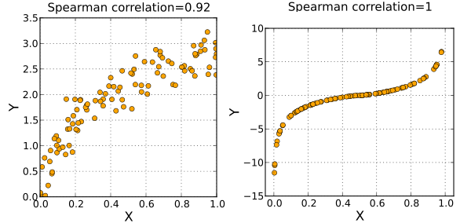

```{r setup, include=FALSE}
knitr::opts_chunk$set(echo = TRUE)
```
## Descriptive statistics for numeric data  
Here will cover measures of central tendency, variability, and distribution shape for continuous variables.

### Summary Statistics for every column  
R provides a wide range of functions for obtaining summary statistics. One method of obtaining descriptive statistics is to use the sapply( ) function with a specified summary statistic. Possible functions used in **sapply** include **mean, sd, var, min, max, median, range, and quantile**.

We mainly use two datasets to demonstrate: [mtcars](https://stat.ethz.ch/R-manual/R-devel/library/datasets/html/mtcars.html) and [iris](http://rstudio-pubs-static.s3.amazonaws.com/450733_9a472ce9632f4ffbb2d6175aaaee5be6.html)  

```{r include = FALSE}
# get means for variables in data frame mydata
# excluding missing values
sapply(mtcars, mean, na.rm = TRUE)
```

There are numerous R functions designed to provide a range of descriptive statistics at once. For example
```{r include = FALSE}
# mean,median,25th and 75th quartiles,min,max
summary(mtcars)

# Tukey min,lower-hinge, median,upper-hinge,max
fivenum(as.matrix(mtcars))
```

Besides the R base package, a few other packages contain functions for descriptive statistical analysis, including packages Hmisc, pastecs, and psych.  
```{r include = FALSE}
if (!require("Hmisc")) {install.packages("Hmisc")}
library(Hmisc)
describe(mtcars)
# n, nmiss, unique, mean, 5,10,25,50,75,90,95th percentiles
# 5 lowest and 5 highest scores

library(pastecs)
stat.desc(mtcars)
# nbr.val, nbr.null, nbr.na, min max, range, sum,
# median, mean, SE.mean, CI.mean, var, std.dev, coef.var
if (!require("psych")) {install.packages("psych", dependencies = TRUE)}
library(psych)
describe(mtcars)
# item name ,item number, nvalid, mean, sd,
# median, mad, min, max, skew, kurtosis, se
```

### Summary Statistics by Group
A simple way of generating summary statistics by grouping variable is available in the psych package.  
```{r}
library(psych)
with(iris, describeBy(iris, group = Species))
```
The doBy package provides much of the functionality of SAS PROC SUMMARY. It defines the desired table using a model formula and a function. Here is a simple example.  
```{r}
library(doBy)
# produces mpg.m wt.m mpg.s wt.s for each
# combination of the levels of cyl and vs
summaryBy(mpg + wt ~ cyl + vs, data = mtcars,
  FUN = function(x) {c(m = mean(x, na.rm = TRUE), 
                       s = sd(x, na.rm = TRUE))})

```
## Summary statistics for categorical data  
This section describes the creation of frequency and contingency tables from categorical variables, along with tests of independence, measures of association, and methods for graphically displaying results.  

### Frequencies and crosstables  
You can generate frequency tables using the table( ) function, tables of proportions using the prop.table( ) function, and marginal frequencies using margin.table( ).  
```{r}
if (!require("vcd")) install.packages("vcd")
library(vcd)
head(Arthritis)
# 2-Way Frequency Table
attach(Arthritis)
mytable <- table(Treatment, Sex) # A will be rows, B will be columns
mytable # print table

margin.table(mytable, 1) # A frequencies (summed over B)
margin.table(mytable, 2) # B frequencies (summed over A)

prop.table(mytable) # cell percentages
prop.table(mytable, 1) # row percentages
prop.table(mytable, 2) # column percentages
```

table( ) can also generate multidimensional tables based on 3 or more categorical variables. In this case, use the ftable( ) function to print the results more attractively.  
```{r}
# 3-Way Frequency Table
mytable <- table(Treatment, Sex, Improved)
ftable(mytable)
```
The xtabs( ) function allows you to create crosstabulations using formula style input.  

```{r}
# 3-Way Frequency Table
mytable <- xtabs(~Treatment + Sex + Improved, data = Arthritis)
ftable(mytable) # print table
summary(mytable) # chi-square test of indepedence
```

### Independence Tests 
1. Chi-Square Test  
For 2-way tables you can use chisq.test(mytable) to test independence of the row and column variable. By default, the p-value is calculated from the asymptotic chi-squared distribution of the test statistic. Optionally, the p-value can be derived via Monte Carlo simulation. If one cell of the table's expected value is less than five, the chi-square approximation is applied and p-value is not reliable.
```{r}
library(vcd)
mytable <- xtabs( ~ Treatment + Improved, data = Arthritis)
chisq.test(mytable)
```

2. Fisher Exact Test  
Fisher's exact test evaluates the null hypothesis of independence of rows and columns in a contingency table with fixed marginals. If one cell of the table's expected value is less than five, use Fisher's exact test.  

```{r}
mytable <- xtabs( ~ Treatment + Improved, data = Arthritis)
fisher.test(mytable)
```

### Measures of association  
The significance tests evaluate whether sufficient evidence exists to reject a null hypothesis of independence between variables. If you can reject
the null hypothesis, the you can use the assocstats() function in the
vcd package to calculate the association: the phi coefficient, contingency coefficient, and Cramer's V for a two-way table.  
```{r}
library(vcd)
mytable <- xtabs( ~ Treatment + Improved, data = Arthritis)
assocstats(mytable)
```

### Visualizing results
Use bar charts for visualizing frequencies in one dimension.

Use the vcd package for visualizing relationships among categorical data (e.g. mosaic and association plots).

Use the ca package for correspondence analysis (visually exploring relationships between rows and columns in contingency tables).

## Correlations  
Common types of correlations: Pearson CC, Spearman CC, and Kendall CC. to decide to use what type of correlation, always plot your data first to see the distribution of each variable and relationship between variables.  

* Pearson product-moment correlation: the degree of linear relationship
between two quantitative variables. Assumption: normal distributions, linearity and equal-variance. Normally distributed variables have a bell-shaped curve Linearity assumes a straight line relationship between each of the two variables and equal-variance assumes that data is equally distributed about the regression line.  
Good examples where PCC applies.  
  

Misleading Pearson CC:  
  

* Spearman's rank-order correlation coefficient: the degree of relationship between two rank-ordered variables. The assumptions of the Spearman correlation are that data must be at least ordinal and the scores on one variable must be monotonically related to the other variable.  

Good examples where SCC applies.  


* Kendall rank correlation: a non-parametric test that measures the strength of dependence between two variables.  If we consider two samples, a and b, where each sample size is n, we know that the total number of pairings with a b is n(n-1)/2. Kendall rank correlation = (Nc-Nd)/(n(n-1)/2),  
where,  Nc= number of concordant pair; Nd= Number of discordant pair. 

Good examples of using Kendall CC.  
  

You can use the cor() function to produce correlations and the cov( ) function to produces covariances.

```{r eval = FALSE}
cor(x, y = NULL, use = "everything",
    method = c("pearson", "kendall", "spearman"))

# use: Specifies the handling of missing data. Options are all.obs (assumes no missing data - missing data will produce an error), complete.obs (listwise deletion), and pairwise.complete.obs (pairwise deletion)  
# method: Specifies the type of correlation. Options are pearson, spearman or kendall.
```

```{r}
# Correlation matrix from mtcars
# with mpg, cyl, and disp as rows
# and hp, drat, and wt as columns
x <- mtcars[1:3]
y <- mtcars[4:6]
cor(x, y)
```
Use the cor.test( ) function to test a single correlation coefficient.
```{r}
cor.test(mtcars[,3], mtcars[,5])
```

The rcorr( ) function in the Hmisc package produces correlations/covariances and significance levels for pearson and spearman correlations. However, input must be a matrix and pairwise deletion is used.

```{r include = FALSE}
# Correlations with significance levels
library(Hmisc)
rcorr(as.matrix(mtcars), type = "pearson") # type can be pearson or spearman

#mtcars is a data frame
rcorr(as.matrix(mtcars))
```
### Other Types of Correlations  
```{r eval = FALSE}
# polychoric correlation
# x is a contingency table of counts
library(polycor)
polychor(x)

# heterogeneous correlations in one matrix
# pearson (numeric-numeric),
# polyserial (numeric-ordinal),
# and polychoric (ordinal-ordinal)
# x is a data frame with ordered factors
# and numeric variables
library(polycor)
hetcor(x)

# partial correlations
library(ggm)
colnames(states)
pcor(c(1,5,2,3,6), cov(states))
# partial corr between columns 1 and 5 controlling for columns 2, 3, and 6
```

### Visualizing Correlations
Use the pairs() or splom() to create scatterplot matrices. Use corrgram() or corrplot() to plot correlograms. We have covered this in last section.  

