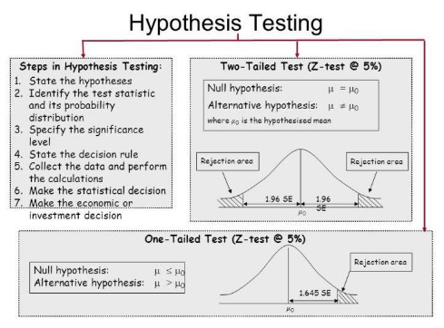
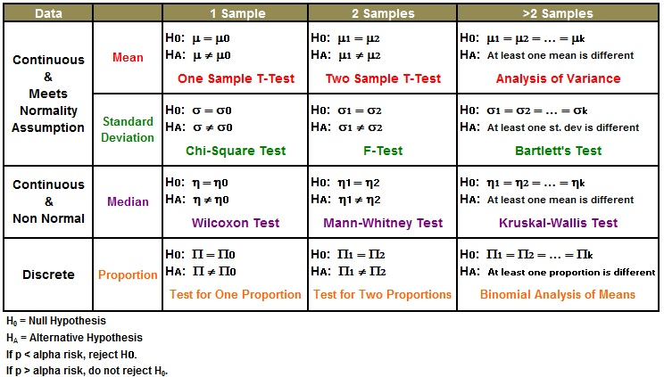
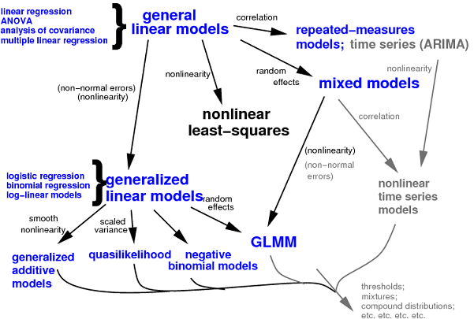
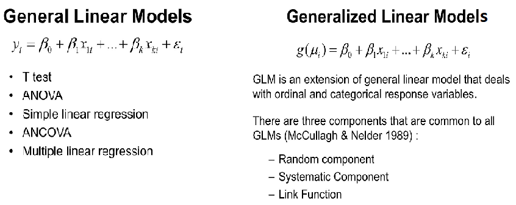
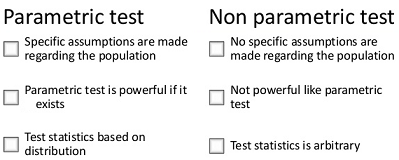
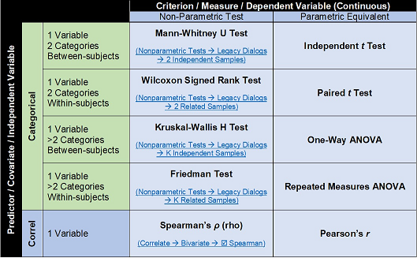

```{r include = FALSE}
knitr::opts_chunk$set(echo = TRUE, eval=TRUE, fig.width = 4, 
                      fig.height = 5, warning = FALSE, 
                      message = FALSE, encoding = "UTF-16")
```

For more details about hypothesis testing, please refer to [R in Action: Data analysis and graphics with R, 2nd ed.](http://kek.ksu.ru/eos/DataMining/1379968983.pdf).  

Steps of hypothesis testing: take t-test as an example.  
  

A guide of choosing hypothesis tests is shown here:  
  

## Parametric hypothesis testing  
The relationship of different models used for parametric hypothesis test are shown below. Differnt models can be used to get parameter estimates using different statistic models before calculating the test statistics.   
  

Differences between general linear models and generalized linear models are listed below.  

  

### t-tests (one or two groups)  
The t.test( ) function produces a variety of t-tests on **data assuming (approximately) normal distribution**. Unlike most statistical packages, the default assumes unequal variance and applies the Welsh df modification.

```{r eval = FALSE}
library(MASS)


# one sample t-test
set.seed(1234)
my_data <- data.frame(
  name = paste0(rep("M_", 10), 1:10),
  weight = round(rnorm(10, 20, 2), 1)
)
t.test(my_data$weight, mu = 25) # Ho: mu=25


# Two independent sample t-test
# independent 2-group t-test
t.test(Prob ~ So, data=UScrime) 

# independent 2-group t-test
t.test(UScrime$Prob, UScrime$So) # where y1 and y2 are numeric

# Two paired sample t-test
with(UScrime, t.test(U1, U2, paired=TRUE)) 
```

You can use the var.equal = TRUE option to specify equal variances and a pooled variance estimate. You can use the alternative="less" or alternative="greater" option to specify a one tailed test.

Use box plots or density plots to visualize group differences.


### ANOVA (multi-groups)
A good online presentation on ANOVA in R can be found in [ANOVA](http://personality-project.org/r/r.guide/r.anova.html#oneway) section of the Personality Project. To apply ANOVA, two assumption about the data should be met:  

* The population from which samples are drawn should be normally distributed.  
* Independence of cases: the sample cases should be independent of each other.  
* Homogeneity of variance: Homogeneity means that the variance among the groups should be approximately equal.  

1. Fit a Model  
In the following examples lower case letters are numeric variables and upper case letters are factors.  

ANOVA for independent data.  
```{r eval = FALSE}
# One Way Anova (Completely Randomized Design)
fit <- aov(y ~ A, data=mydataframe)

# Randomized Block Design (B is the blocking factor)
fit <- aov(y ~ A + B, data=mydataframe)

# Two Way Factorial Design
fit <- aov(y ~ A + B + A:B, data=mydataframe)
fit <- aov(y ~ A*B, data=mydataframe) # same thing

# Analysis of Covariance
fit <- aov(y ~ A + x, data=mydataframe)
```
Repeated measures ANOVA:  
Correlated data: For within subjects designs, the data frame has to be rearranged so that each measurement on a subject is a separate observation.  

```{r eval = FALSE}
# One Within Factor
fit <- aov(y~A+Error(Subject/A),data=mydataframe)

# Two Within Factors W1 W2, Two Between Factors B1 B2
fit <- aov(y~(W1*W2*B1*B2)+Error(Subject/(W1*W2))+(B1*B2),
   data=mydataframe)
```

2. Look at Diagnostic Plots  
Diagnostic plots provide checks for heteroscedasticity, normality, and influential observations. For details on the evaluation of test requirements, see (M)ANOVA Assumptions.  
```{r eval = FALSE}
layout(matrix(c(1,2,3,4),2,2)) # optional layout
plot(fit) # diagnostic plots
```
3. Evaluate Model Effects  
WARNING: R provides Type I sequential SS, not the default Type III marginal SS reported by SAS and SPSS. In a nonorthogonal design with more than one term on the right hand side of the equation order will matter (i.e., A+B and B+A will produce different results)! We will need use the drop1( ) function to produce the familiar Type III results. It will compare each term with the full model. Alternatively, we can use anova(fit.model1, fit.model2) to compare nested models directly.
```{r eval = FALSE}
summary(fit) # display Type I ANOVA table
drop1(fit,~.,test="F") # type III SS and F Tests
```

4. p-value adjustment for multiple Comparisons  
You can get Tukey HSD tests using the function below. By default, it calculates post hoc comparisons on each factor in the model. You can specify specific factors as an option. Again, remember that results are based on Type I SS!
```{r eval = FALSE}
# Tukey Honestly Significant Differences
TukeyHSD(fit) # where fit comes from aov()
```
5. Visualizing Results  
Use box plots and line plots to visualize group differences. There are also two functions specifically designed for visualizing mean differences in ANOVA layouts. interaction.plot( ) in the base stats package produces plots for two-way interactions. plotmeans( ) in the gplots package produces mean plots for single factors, and includes confidence intervals.

```{r}
if (!require(multcomp)) install.packages("multcomp")
library(multcomp)
attach(cholesterol)
fit <- aov(response ~ trt)
summary(fit)
library(gplots)

plotmeans(response ~ trt, xlab = "Treatment", ylab = "Response",
main = "Mean Plot\nwith 95% CI")

TukeyHSD(fit)

detach(cholesterol)
```

```{r}
# Two-way Interaction Plot
suppressMessages(attach(mtcars))
gears <- factor(gear)
cyl <- factor(cyl)
interaction.plot(
    cyl,
    gear,
    mpg,
    type = "b",
    col = c(1:3),
    leg.bty = "o",
    leg.bg = "beige",
    lwd = 2,
    pch = c(18, 24, 22),
    xlab = "Number of Cylinders",
    ylab = "Mean Miles Per Gallon",
    main = "Interaction Plot"
)
detach(mtcars)
```

### Multiple (Linear) Regression
R provides comprehensive support for multiple linear regression. The topics below are provided in order of increasing complexity.

1. Fitting the Model  
```{r eval = FALSE}
# Multiple Linear Regression Example
fit <- lm(y ~ x1 + x2 + x3, data=mydata)
summary(fit) # show results

# Other useful functions
coefficients(fit) # model coefficients
confint(fit, level=0.95) # CIs for model parameters
fitted(fit) # predicted values
residuals(fit) # residuals
anova(fit) # anova table
vcov(fit) # covariance matrix for model parameters
influence(fit) # regression diagnostics
``` 
2. Diagnostic Plots  
Diagnostic plots provide checks for heteroscedasticity, normality, and influential observations.
```{r eval = FALSE}
# diagnostic plots
layout(matrix(c(1,2,3,4),2,2)) # optional 4 graphs/page
plot(fit)
```
3. Comparing Models  
You can compare nested models with the anova( ) function. The following code provides a simultaneous test that x3 and x4 add to linear prediction above and beyond x1 and x2.
```{r eval = FALSE}
# compare models
fit1 <- lm(y ~ x1 + x2 + x3 + x4, data=mydata)
fit2 <- lm(y ~ x1 + x2)
anova(fit1, fit2)
```
4. Cross Validation (A machine learning method for model comparison if you have enough data)  
You can do K-Fold cross-validation using the cv.lm( ) function in the DAAG package.
```{r eval = FALSE}
# K-fold cross-validation
library(DAAG)
cv.lm(df=mydata, fit, m=3) # 3 fold cross-validation
```
Sum the MSE for each fold, divide by the number of observations, and take the square root to get the cross-validated standard error of estimate.

You can assess R2 shrinkage via K-fold cross-validation. Using the crossval() function from the bootstrap package, do the following:

```{r eval = FALSE}
# Assessing R2 shrinkage using 10-Fold Cross-Validation
fit <- lm(y~x1+x2+x3,data=mydata)

library(bootstrap)
# define functions
theta.fit <- function(x,y){lsfit(x,y)}
theta.predict <- function(fit,x){cbind(1,x)%*%fit$coef}

# matrix of predictors
X <- as.matrix(mydata[c("x1","x2","x3")])
# vector of predicted values
y <- as.matrix(mydata[c("y")])

results <- crossval(X,y,theta.fit,theta.predict,ngroup=10)
cor(y, fit$fitted.values)**2 # raw R2
cor(y,results$cv.fit)**2 # cross-validated R2
```

5. Variable Selection  
Selecting a subset of predictor variables from a larger set (e.g., stepwise selection, forward and backward selection) is a controversial topic. You can perform stepwise selection (forward, backward, both) using the stepAIC( ) function from the MASS package. stepAIC( ) performs stepwise model selection by exact AIC.

```{r eval = FALSE}
# Stepwise Regression
library(MASS)
fit <- lm(y~x1+x2+x3,data=mydata)
step <- stepAIC(fit, direction="both")
step$anova # display results
```
Alternatively, you can perform all-subsets regression using the leaps( ) function from the leaps package. In the following code nbest indicates the number of subsets of each size to report. Here, the ten best models will be reported for each subset size (1 predictor, 2 predictors, etc.).

```{r eval = FALSE}
# All Subsets Regression
library(leaps)
attach(mydata)
leaps<-regsubsets(y~x1+x2+x3+x4,data=mydata,nbest=10)
# view results
summary(leaps)
# plot a table of models showing variables in each model.
# models are ordered by the selection statistic.
plot(leaps,scale="r2")
# plot statistic by subset size
library(car)
subsets(leaps, statistic="rsq")

#Other options for plot( ) are bic, Cp, and adjr2. Other options for plotting with
subset( ) are bic, cp, adjr2, and rss.
```

6. Relative Importance  
The relaimpo package provides measures of relative importance for each of the predictors in the model. See help(calc.relimp) for details on the four measures of relative importance provided.
```{r eval = FALSE}
# Calculate Relative Importance for Each Predictor
library(relaimpo)
calc.relimp(fit,type=c("lmg","last","first","pratt"),
   rela=TRUE)

# Bootstrap Measures of Relative Importance (1000 samples)
boot <- boot.relimp(fit, b = 1000, type = c("lmg",
  "last", "first", "pratt"), rank = TRUE,
  diff = TRUE, rela = TRUE)
booteval.relimp(boot) # print result
plot(booteval.relimp(boot,sort=TRUE)) # plot result
```

7. Graphic Enhancements  
The car package offers a wide variety of plots for regression, including added variable plots, and enhanced diagnostic and Scatterplots.

### Going Further  

1. Nonlinear Regression  
The nls package provides functions for nonlinear regression. See John Fox's Nonlinear Regression and Nonlinear Least Squares for an overview. Huet and colleagues' Statistical Tools for Nonlinear Regression: A Practical Guide with S-PLUS and R Examples is a valuable reference book.

2. Robust Regression  
There are many functions in R to aid with robust regression. For example, you can perform robust regression with the rlm( ) function in the MASS package. John Fox's (who else?) Robust Regression provides a good starting overview. The UCLA Statistical Computing website has Robust Regression Examples.

The robust package provides a comprehensive library of robust methods, including regression. The robustbase package also provides basic robust statistics including model selection methods. And David Olive has provided an detailed online review of Applied Robust Statistics with sample R code.

### Regression Diagnostics
An excellent review of regression diagnostics is provided in John Fox's aptly named Overview of Regression Diagnostics. Dr. Fox's car package provides advanced utilities for regression modeling.
```{r}
# Assume that we are fitting a multiple linear regression
# on the MTCARS data
library(car)
fit <- lm(mpg~disp+hp+wt+drat, data=mtcars)

# This example is for exposition only. We will ignore the fact that this may not be a great way of modeling the this particular set of data!
```
1. Outliers
```{r}
# Assessing Outliers
outlierTest(fit) # Bonferonni p-value for most extreme obs
qqPlot(fit, main="QQ Plot") # qq plot for studentized resid
leveragePlots(fit) # leverage plots
```
2. Influential Observations
```{r}
# Influential Observations
# added variable plots
avPlots(fit)
# Cook's D plot
# identify D values > 4/(n-k-1)
cutoff <- 4/((nrow(mtcars)-length(fit$coefficients)-2))
plot(fit, which=4, cook.levels=cutoff)
# Influence Plot
influencePlot(fit, main="Influence Plot", sub="Circle size is proportional to Cook's Distance" )
```
3. Non-normality  
```{r}
# Normality of Residuals
# qq plot for studentized resid
qqPlot(fit, main="QQ Plot")
# distribution of studentized residuals
library(MASS)
sresid <- studres(fit)
hist(sresid, freq=FALSE,
   main="Distribution of Studentized Residuals")
xfit<-seq(min(sresid),max(sresid),length=40)
yfit<-dnorm(xfit)
lines(xfit, yfit)
```
4. Non-constant Error Variance
```{r}
# Evaluate homoscedasticity
# non-constant error variance test
ncvTest(fit)
# plot studentized residuals vs. fitted values
spreadLevelPlot(fit)
```
5. Multi-collinearity of design matrix
```{r}
# Evaluate Collinearity
vif(fit) # variance inflation factors
sqrt(vif(fit)) > 2 # problem?
```
6. Nonlinearity
```{r}
# Evaluate Nonlinearity
# component + residual plot
crPlots(fit)

# Ceres plots
ceresPlots(fit)
```
7. Non-independence of Errors
```{r}
# Test for Autocorrelated Errors
durbinWatsonTest(fit)
```

Additional Diagnostic Help
The gvlma( ) function in the gvlma package, performs a global validation of linear model assumptions as well separate evaluations of skewness, kurtosis, and heteroscedasticity.
```{r}
# Global test of model assumptions
if (!require("gvlma")) install.packages("gvlma")
library(gvlma)
gvmodel <- gvlma(fit)
summary(gvmodel)
```

### Generalized Linear Models  

Generalized linear models are fit using the glm( ) function. The form of the glm function is
```{r eval = FALSE}
glm(formula, family=familytype, (link=linkfunction), data = data)
```
Common generalized linear models are listed below:  

|Family|Default Link Function|
|------|--------------------|
|binomial|(link = "logit")|
|gaussian|(link = "identity")|
|poisson| (link = "log")|
|negative binomial|(link = "log")|
|quasi|(link = "identity", variance = "constant")|


See help(glm) for other modeling options. See help(family) for other allowable link functions for each family.

## Nonparametric hypothesis test  
Sometimes we don't know what kind of distribution our data assume. Nonparametric hypothesis test is of choice.  

  

Nonparametric tests and the corresponding parametric tests:  
  

##  Convert Statistical Analysis Objects into Tidy Data Frames
broom package (available on CRAN), which bridges the gap from untidy outputs of predictions and estimations to the tidy data we want to work with. It takes the messy output of built-in statistical functions in R, such as lm, nls, kmeans, or t.test, as well as popular third-party packages, like gam, glmnet, survival or lme4, and turns them into tidy data frames. This allows the results to be handed to other tidy packages for downstream analysis: they can be recombined using dplyr or visualized using ggplot2. For more, see [its documentation](https://www.rdocumentation.org/packages/broom/versions/0.3.7).

```{r}
fit <- lm(mpg ~ wt + qsec, mtcars)
summary(fit)
library(broom)
tidy(fit)

library(dplyr)
mtcars %>% group_by(am) %>% do(tidy(lm(mpg ~ wt, .)))

# If you're interested in extracting per-observation information, such as fitted values and residuals, use the augment() method, which adds these to the original data:

head(augment(fit))

# glance() computes per-model statistics, such as $R^2$, AIC, and BIC:
glance(fit)
```
