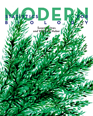
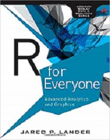
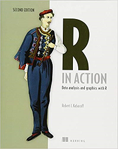
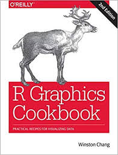
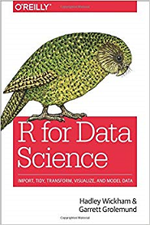
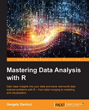
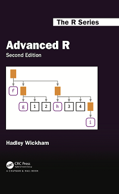
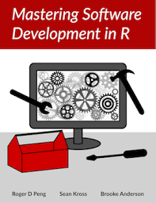
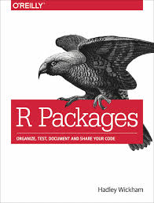

```{r include = FALSE}
knitr::opts_chunk$set(echo = TRUE, eval=TRUE, fig.width = 4, 
                      fig.height = 5, warning = FALSE, 
                      message = FALSE, encoding = "UTF-16")
```

## Awesome R packages
Highly recommended packages for data analysis with R: [**tidyverse**](https://tidyverse.tidyverse.org/).

### Core tidyverse packages for data science:  

* ggplot2, for data visualization.  
* dplyr, for data manipulation.  
* tidyr, for data tidying.  
* readr, for data import.  
* purrr, for functional programming.  
* tibble, for tibbles, a modern re-imagining of data frames.  
* stringr, for strings. 
* lubridate, for date and time.  
* forcats, for factors.  
* broom, tidying statistical testing output

### R packages for interactive data visualization:  

* shiny, for building App for interactive data visualization. See [its Rstudio tutorials](https://shiny.rstudio.com/tutorial/).    
* plotly, for making interactive, publication-quality graphs. See [its official site](https://plot.ly/r/).  
* htmlwidgets: Bring the best of JavaScript data visualization to R. See [its official site](https://www.htmlwidgets.org/).   
* threejs: provides interactive 3D scatterplots and globe plots using three.js and the htmlwidgets package for R. See [its official site](https://bwlewis.github.io/rthreejs/).  
* googleVis: providing interface to Google's chart tools. See [its GitHub documents](https://github.com/mages/googleVis#googlevis).   

### R packages for [Reproducible research](https://cran.r-project.org/web/views/ReproducibleResearch.html)  

* rmarkdown  
* knitr  

For more awesome R packages, see [this page](https://awesome-r.com/). 

## Awesome R books  

For more awesome books, see [this page](https://github.com/RomanTsegelskyi/rbooks). Here I recommend a few really worthy of your time if you want to improve your R skills.  

1. Modern Statistics for Modern Biology, by Susan Holmes, and Wolfgang Huber  
  

<br/>

2. R for Everyone: Advanced Analytics and Graphics, by Jared P. Lander  
  

<br/>

3. R in Action: Data Analysis and Graphics with R, by Robert Kabacoff  
  

<br/>

4. R Graphics Cookbook, by Winston Chang.  
  

<br/>

5. R for Data Science, by Hadley Wickham  
  

<br/>

6. Mastering Data Analysis with R, by Gergely Daróczi  
  

<br/>

7. Advanced R, 2nd ed. by Hadley Wickham  
  

<br/>

8. Mastering software development in R, by Roger Peng, Sean Kross and Brooke Anderson  
  

<br/>

9. R packages, by Hadley Wickham  
  

## Further learning recommendations  

1. Read this blog [R Learning Path: From beginner to expert in R in 7 steps](https://www.kdnuggets.com/2016/03/datacamp-r-learning-path-7-steps.html).  

2. Read some of the awesome books on R.  

3. Learn packages by reading their vignettes and reference manuals.  

4. Learn by reviewing otherPkgs source code.  
It can be instructive to look at the code of functions in R base and other famous packages. In R, you can view a function's code by typing the function name without the ( ). If this method fails, look at the following [GitHub document](https://github.com/jennybc/access-r-source) for hints on viewing function source code. Ultimately, you can download the package source code in XXXX.tar.gz from CRAN or Bioconductor, or just  from the GitHub/other source code depositories, and read it.  

5. Practice and practice!
Once you write your own functions, try your best to improve its style, documentation, and performance. Get comments from your friends with R programming expertise.  
